## はじめに

こんにちは。物理部PC班ではゲームを作っていますが，そのゲームを作る中で多分最初の難関が「当たり判定」ではないでしょうか。ここでは，どのようにして当たり判定が行われているのか説明したいと思います。

かなり難しくなってしまったので，読み飛ばしてもかまいません。そして，ここに書いてある当たり判定は実際に必要になった時に自分で考えたものなので，もしかしたらもっといい方法があるかもしれません。

また，図は適当に書いたものなので，参考程度にしてください。

## 座標とは

まずは，「座標」について説明したいと思います。（座標は中学で習うので，ここに書かれていることは分からなくても気にしないでください。）

座標とは下のようなものです。例えば，点Aのx座標は７，y座標は５というような感じです。

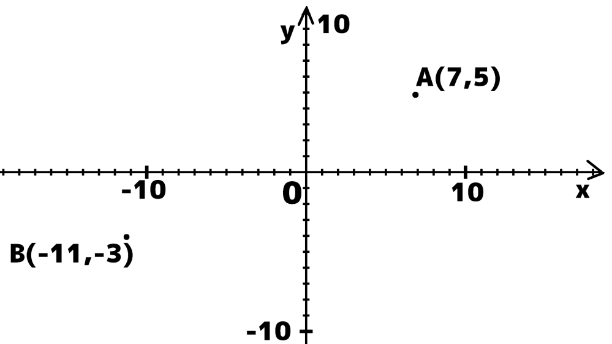

ただし，数学で言う座標は普通，↑のことなのですが，コンピューターの画面で言う座標はこれとは違って，一番左上が（０，０）で，横に行くほどｘが大きく，下に行くほどｙが大きく（ｙだけ逆に）なっています。

PCやテレビの画面をよく見ると，ドットがたくさんあるのがわかりますか？そうです。これの一つ一つに座標が割り振られていて，一番左上が（０，０）です。そして，今のほとんどのテレビ（フルハイビジョン）は横に1920個，縦に1080個あります。ゲームなどでも，ウインドウの中の一番左上を（０，０）としています。

## 点と点の当たり判定

さて，ここからは実際に当たり判定を考えていきましょう。

まずは，点Aと，点Bの当たり判定をしてみましょう。

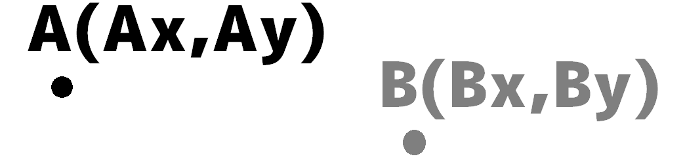

例えば，A（３，５）とB（２，５）があった時，これは重なっていますか？もちろん，重なってないですよね。つまり，点と点の当たり判定をするときはそれぞれx座標とｙ座標が等しいかどうかを判定するだけです。

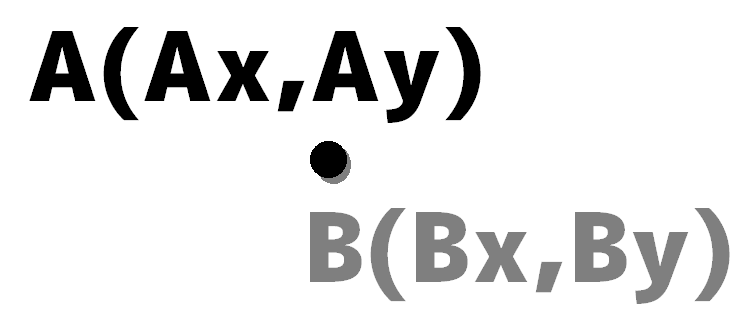

つまり，右のとき，「AｘとBｘが等しく，AｙとBｙが等しいとき」，この２つの点は，重なっているということになります。

## 長方形と長方形の当たり判定

つぎに，一気にハードルを上げて長方形と長方形の当たり判定をしてみたいと思います。
ただし，長方形は傾いていないものとします。

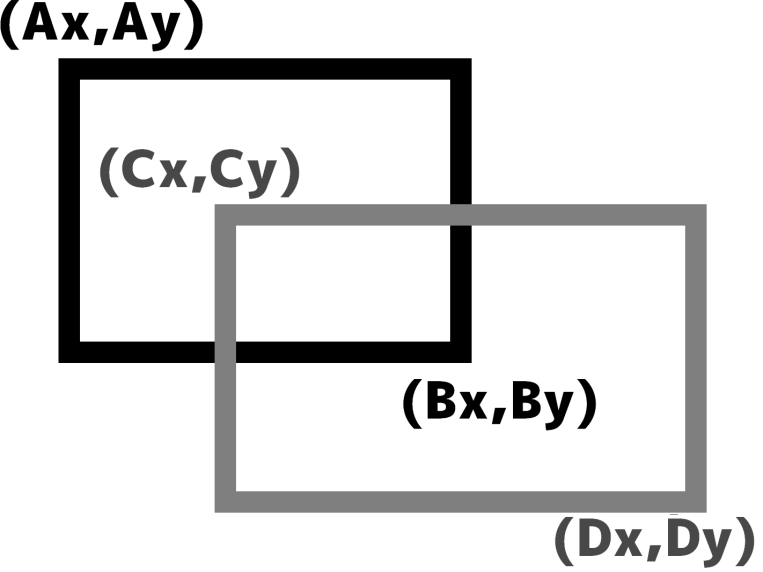

例えば上のような２つの長方形があったとします。この２つはどのように当たり判定をすればいいと思いますか？

（この微妙な空白を埋めるのに少
しお付き合いください。）

実は，一番最初にこれの当たり判定をしようとした時，それぞれの点が長方形の中に入っているかどうかで判定をして，長方形と長方形がクロスしている（スイスの国旗みたいな形）パターンを見落としていて，４時間それに気づかず悩まされたときがあります。（実話）

その後，いろいろ調べてみると，下のように判定する方法を見つけました。よく使われる方法は下のようにｘ軸とｙ軸を分けて考えるという方法です。

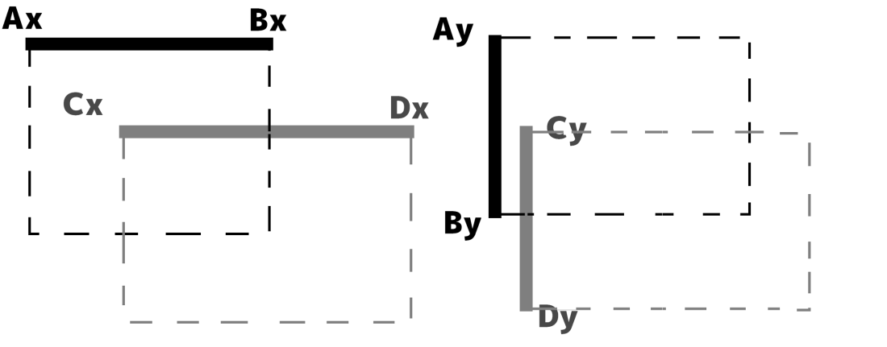

まずx軸について。

下に，考えられるものをすべて上げてみました。下のどの場合でもあたっていることにすればいいので，「DxがAxより大きく（右にある），CxがBxより小さければ（左にあれば）」当っているということになります。

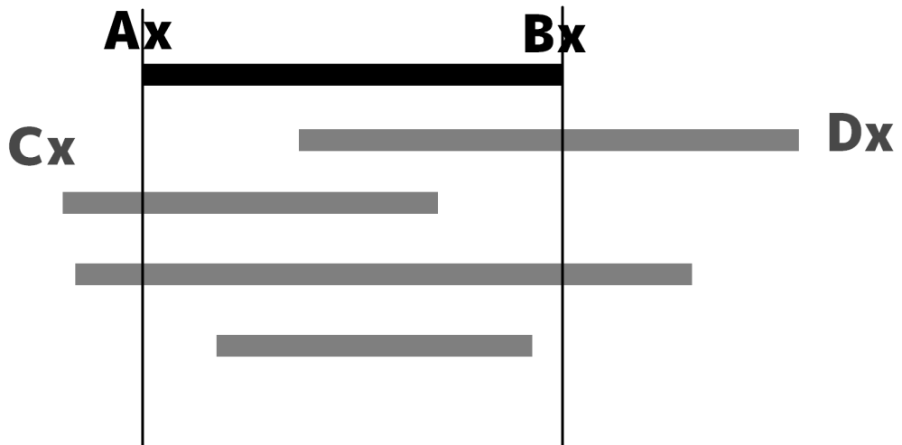

同じようにy座標も考えて，「DxがAxより大きく，BxがCxより小さく，DyがAyより大きく，ByがCyより大きければ」当たったということになります。（点Aは点Bより左上，点Cも点Dより左上とする）

## 円と点の当たり判定

下のような円（半径をｒとする）と点の当たり判定をしてみましょう。

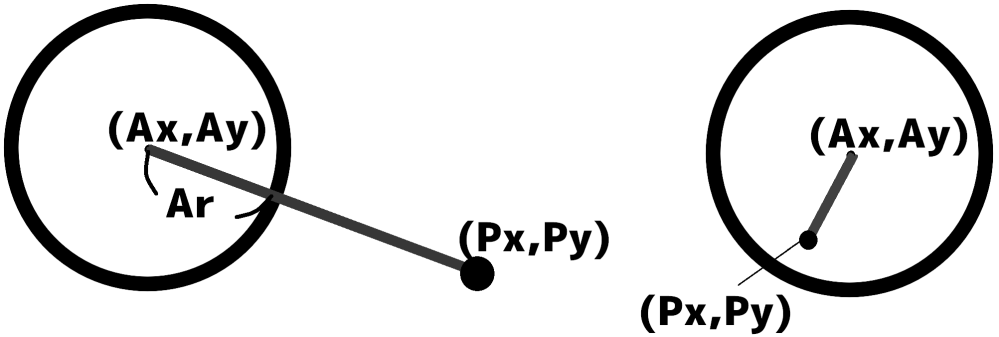

実は，円と点の当たり判定は長方形と長方形の当たり判定よりはるかに簡単で，「円の中心から点までの距離が円の半径より短ければ当たった，長ければ当たっていない，同じなら点は円上にある」です。（点と点の距離を求める公式は中学で習います。）

## 円と円の当たり判定

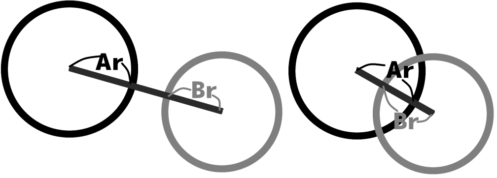

一見むずかしそうな気がするのですが，じつはこれも簡単（こんなに小さなところに書
けるくらい）で，「それぞれの中心の距離がそれぞれの半径の和より小さければ」当たったとなります。

## 線分とx軸に平行な線分の当たり判定

（「線分」とは，長さが決まっている直線のこと。「直線」の長さは無限。<s>あれ，矛盾してる。</s>）

線分と線分（x軸に平行かどうかわからない）の当たり判定はかなり難しいので気になる人は自分で考えてみてください。

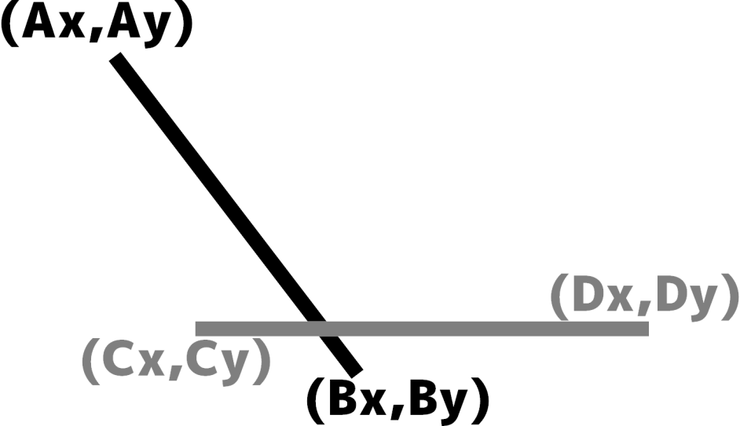

まずは，上のような２本の線分があったとします。（Cy＝Dyとする）濃い線を線分AB，薄い線を線分CDとします。

最初に，長方形と長方形の当たり判定でもやったように，y軸だけを考えます。

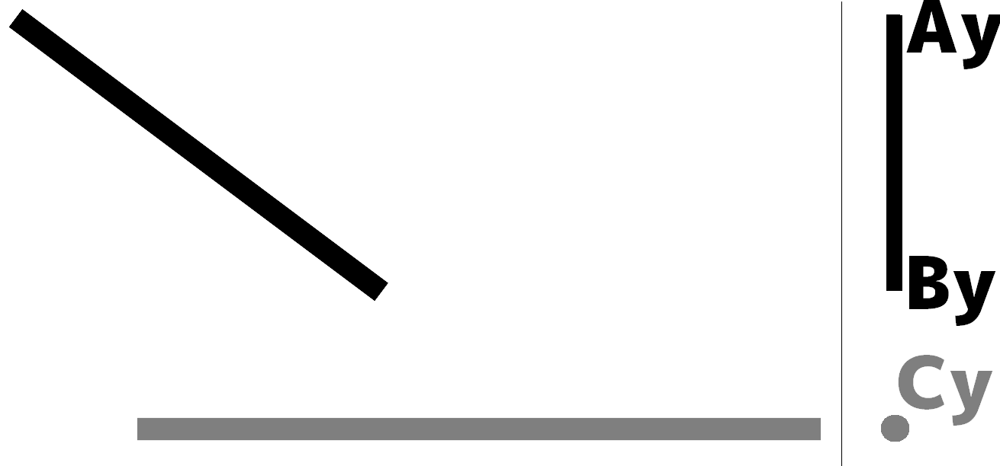

上の場合は，AyとByの間にCyがないので，絶対に当たらないですよね。つまり，１つ目の条件は「AyとByの間にCyがある」と当たっているです。

次に，上の条件に当てはまっているとき。

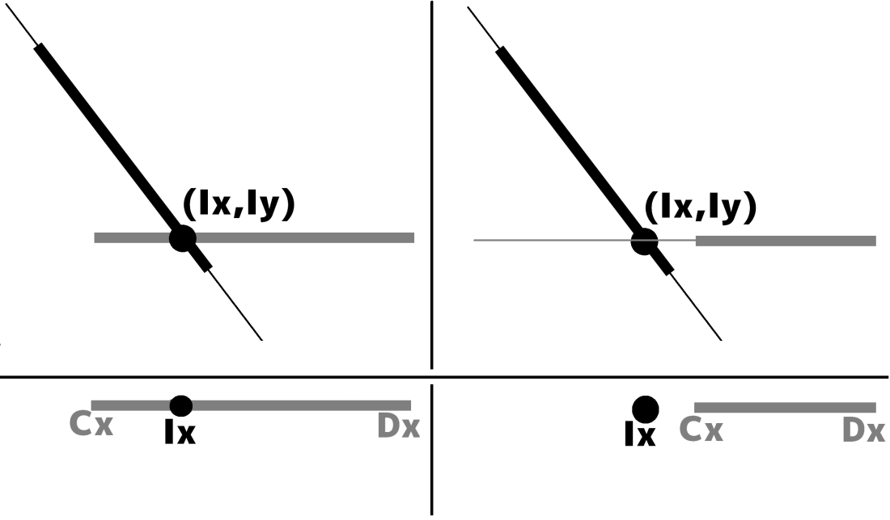

<u><b>直線</b></u>ABと<u><b>直線</b></u>CDの交点（交わっている点のこと）を求めて，
その点が線分CDの上にあるかを判定すれば，当たり判定ができます。つまり，「AyとByの間にCyがあり，２つの直線の交点のx座標がCxとDxの間にあれば」当っているということになります。

## おわりに

ここまで読んでくれてありがとうございます。m(__)m

少し駆け足な感じになってしまいました。たぶん最後までわかったという方は少ないのではないのでしょうか。分からなくても入試に出ることは無いと思うので，無理に理解する必要はありませんが，どのようにして当たり判定がされているか少しでも興味を持っていただけたら幸いです。