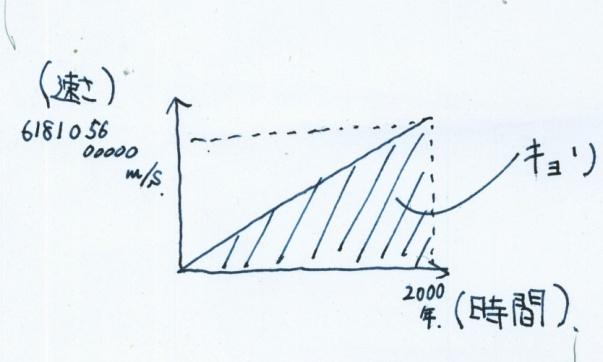
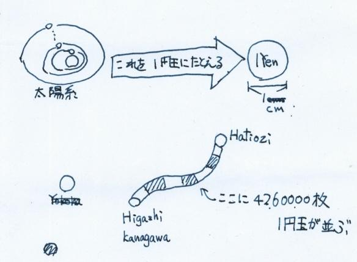
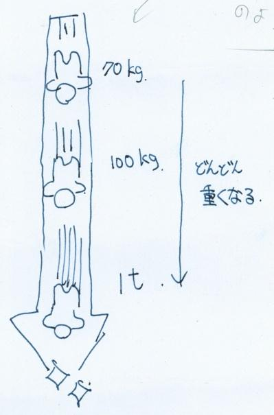
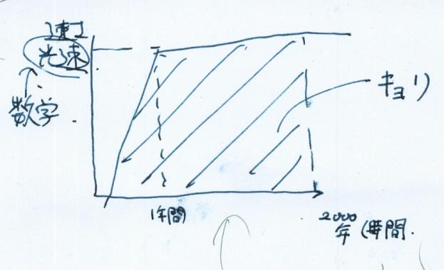
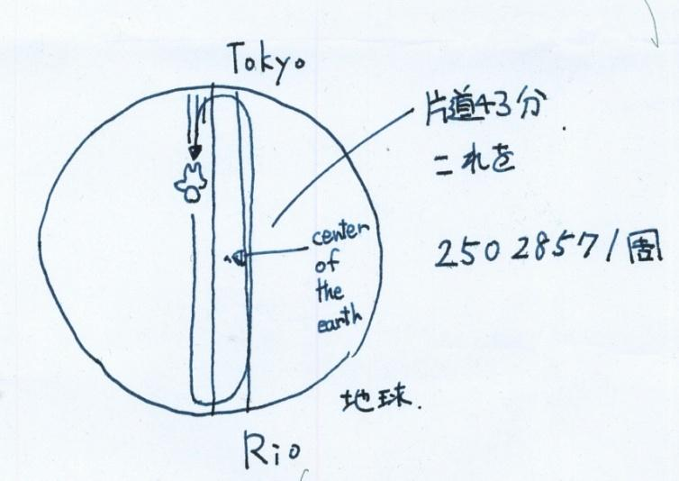

## 初めに

今回で最後になりました、どうでもいいことを物理的に検証するというという企画です。今回検証するのは、この阿鼻地獄の刑罰の、2000年間落ち続けるというものです。早速ですが、Let's 計算！

<blockquote>

阿鼻地獄とは…

罪：殺生、盗み、邪淫、飲酒、妄語、邪見、犯持戒人、父母・阿羅漢（聖者）殺害。

具体的説明：地獄の最下層に位置する。大きさは前の7つの地獄よりも大きく、縦横高さそれぞれ2万由旬（8万由旬とする説もある）。最下層ゆえ、この地獄に到達するには、真っ逆さまに（自由落下速度で）落ち続けて2000年かかるという。前の七大地獄並びに別処の一切の諸苦を以て一分として、大阿鼻地獄の苦、1000倍もあるという。剣樹、刀山、湯などの苦しみを絶え間（寸分・刹那）なく受ける。背丈が4由旬、64の目を持ち火を吐く奇怪な鬼がいる。舌を抜き出されて100本の釘を打たれ、毒や火を吐く虫や大蛇に責めさいなまれ、熱鉄の山を上り下りさせられる。</blockquote>

これまでの7つの地獄でさえ、この無間地獄に比べれば夢のような幸福であるという、とんでもない地獄です。

## 問（配点ｎ点）

地獄の最深部にあるという、阿鼻地獄に到達するためには、2000年間落ち続ける必要があるという。

この時、ある罪びとが、紀元後16年に裁かれて、阿鼻地獄に落ちたとする。さて、この時、落下を始めてから２０００年後、つまり現在の落下速度は、いくつでしょう？また、この時落下した距離は、何キロメートルでしょう？ただし、重力加速度は、9.8m/sとする。ただし、空気抵抗などは考えず、基本的に物理基礎の考え方で考える。

### 解答1

まず、単純に、（速度）=（落下開始時の速度）+（時間）*（加速度）という、もっとも単純な計算式で考えてみよう。

すると、

$$（速度）=0+（2000\times365\times24\times60\times60）\times9.8 $$

をする。

$$\begin{align*}（速度）&=0+63,072,000,000\times9.8
\\&=618,105,600,000（\mathrm{m/s}）\end{align*}$$

となる。

しかし、これは、正解とはならない。残念！

なぜならば、特殊相対性理論によって、すべての物体は、光の速さを超えないというルールみたいなものがあるので、光速つまり、$299,792,458\mathrm{m/s}$を優に超えてしまうので、まちがいとなる。

ちなみに、この時の落下距離は、いま、等加速度落下なので、

$$（距離）=（最高速度）\times（時間）\div2 $$

で求められるので、

$$\begin{align*}*（距離）& =618,105,600,000\times63,072,000,000\div2\\
& =38,985,156,403,200,000,000,000\div2\\
& =19,492,578,201,600,000,000,000（\mathrm{m}）\\
& =19,492,578,201,600,000,000(\mathrm{km})\\
& =2,060,308.445365183（光年）\end{align*}$$

※一光年を9461000000000キロメートルとする

うん。やばい距離ですね。

ちなみに、太陽系の直径は約0.000475光年らしいので、約4337490526.315789倍だそうです。わかりにくいので、太陽系を一円玉に例えると、横浜線の全長くらいになります。

つまり、とんでもなく長いということです。

### 解答2

次に、物体が光速に近くほど、その物体は重くなるというルールをつかって、考えてみましょう。つまり、光速に達したら、そこから早くならないという過程で計算してみましょう。

$$\begin{align*}299,792,458&=0+（時間）\times9.8
\\（時間）&=30,591,067.14285714秒
\\&\fallingdotseq509,851分
\\&\fallingdotseq8,500時間
\\&\fallingdotseq1年\end{align*}$$

つまり１年間は等加速度運動で以降は光速の速さで党則運動をするので、

$$\begin{align*}（距離）&=299,792,458\times31,536,000\div2
\\&\quad+299,792,458\times31,536,000\times1,999
\\&=300,000,000\times32,000,000\div2
\\&\quad+300,000,000\times32,000,000\times1,999
\\&=19,195,200,000,000,000,000ｍ
\\&=19,195,200,000,000,000ｋｍ
\\&=19,195,200,000\div9,461
\\&≒2,028,876光年\end{align*}$$

やっぱりとんでもなく長い。

### 解答3

最後に距離から、考えてみたいと思う。仮に阿鼻地獄が地球の中心にあったとすると、もうこれは落下とは言えないかもしてないかもしてないが、日本とブラジルを地球の中心を通り、まるで、安部マリオのようにいったりきたりすると仮定すると、単振動で計算すればいいとすると、片道４２分分らしいので、$2000\times365\times24\times60\div42$で何回転するか求められる。計算すると、25,028,571周できる。この時、動く距離は、318,914,051,682キロメートルとなる。この時、マントルにぶつかってあっついとか、この計算で行くと、阿鼻地獄の入り口を25,028,571素通りすることは気にしてはいけない。

## あとがき

ここまで読んでくださりありがとうございました。今回は文化祭二日前に書いたため、計算ミスや誤字があると思いますが、ご了承ください。また、本当は万有引力で計算したりいなければならないところや、実験によって証明されていない、理論を使っているところがありますが、無視しています。文系の学生が作った記事なので温かい目で見てください。