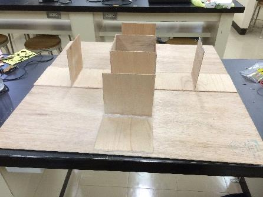

## 前書き

電子工作班中２の安藤です。はじめまして。

マウスレーサーについて、作り方や材料について詳しく書こうと思ったのですが、B5２ページで、と言われたので、マウスレーサーに使われている主要な部品と仕組みになどについて補足程度に書こうと思います。

## 主要部品の説明

* トランジスター

    足が3本あり黒く小さい部品はトランジスターという部品です。流れた電気を増幅する能力などを持っています。

    このマウスレーサーの回路では、センサーで感知し出された電気を増幅し、リレーに流す役割を持っています。

    店で買うと1個10円ぐらいで買えると思います。

* リレー

    ボックス状になっている、大きい部品は、リレーと言います。仕組みは説明すると1ページでは収まらないので、簡単に書くと複雑になっているスイッチのようなものだと思って下さい。このマウスレーサーの回路では、モーターの動きを制御してマウスレーサーの動きを変えています。店で買うと種類によって変わりますが、ここで使ったものは1個360円でした。

* LED

    プラス（アノードA）とマイナス（カソードK）を間違えると光らないというあのLEDです。今回は光を反射させたいので超高輝度というものを使っています。本来は高輝度ですが、大丈夫みたいなので、超の方を使っています。保証はしません。

* お詫び

    ページ数の関係で写真を載せられませんでした。すみません。

## 仕組みについて

マウスレーサーは、簡単に言うと、壁に沿って一定の距離を保ちながら走るロボットです。どうやって一定の距離を保つかと言うとLEDの横にある合計３つのセンサー（フォトトランジスター）で、LEDから出て壁で反射された光を感知します。光を感知すると電気が流れるので、それをトランジスターやリレーでスイッチを切り替えたりしてモーターの動きを制御しています。壁から遠ざけた場合は、左のタイヤだけが回るように、壁に近づけた場合はそれの逆になるようにします。また前の壁に近づけた場合は右だけが回るようにします。

そしてそのセンサーの感度は、前方のセンサーは500ｋΩの、残り２つの右と左を制御するセンサーは、100kΩの半固定抵抗で、ドライバーを使って調整します。この調整が思ったより大変です。（というか、いくら調整しても完璧に作動するか分からない。）

展示されている部屋の光などにも影響されるので外光避けをセンサーにつけても中々あいつは言うことを聞いてくれません。これを作って片山さんの言っていた「センサーは難しいよ。」という意味がようやく分かった気がします。

## 展示されているコースについて

展示されているコースに関して、説明します。中央が四角く囲ってあり、横に4枚立ててある変なものはこのマウスレーサーを動かすためのものです。へこんでいる部分にL字の板や、３枚がくっついた板と1枚の板を全ての箇所に入れ、自分で好きなように動かせます（マウスレーサーの調整がとてもうまくいっていたら）。また板が少し白くなっていますが、それは白色が光を反射しやすいのでスプレーで塗ったからです。板によって白さが異なることは仕方ないと思ってください。

##終わりに
スペースの問題で書ける事はこれぐらいになります。参考にさせて貰ったサイト及び検索の仕方も載せるので、興味があったら、調べてみてください。作り方や部品の詳細について載っています。最後に、電子工作を初めて1年程の素人の僕の記事を読んでいただきありがとうございました。

## 参考サイト

[http://www.murata.com/jajp/campaign/ads/japan/elekids/ele/try/~/media/webrenewal/campaign/ads/japan/elekids/ele/try/koka13f/koka13f0021?la=ja-jp](http://www.murata.com/jajp/campaign/ads/japan/elekids/ele/try/~/media/webrenewal/campaign/ads/japan/elekids/ele/try/koka13f/koka13f0021?la=ja-jp)

←これに作り方など載っています。

１.「電子工作」と調べます。　２.6個目くらいに村田製作所と書いてあるものをクリック　３.開いたページで「KIDS電子工作セカンドシーズン」を開く　４.後は分かると思います。
