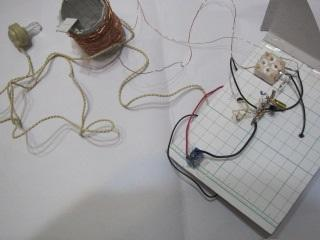
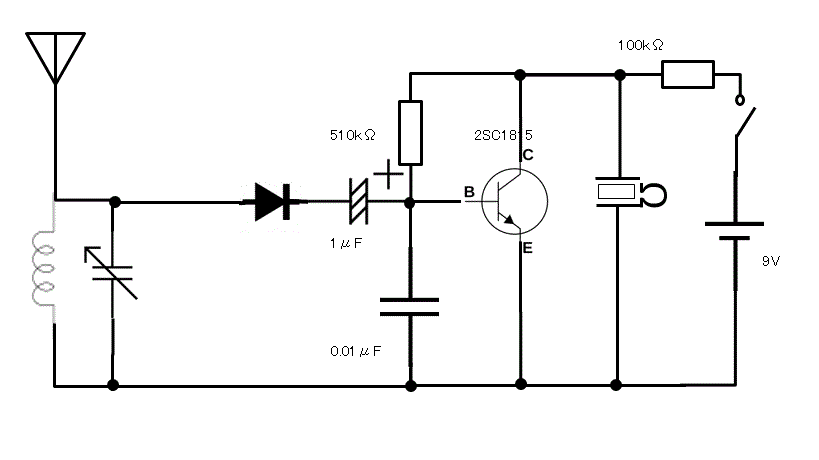

## 初めに

僕は今回、文化祭に向けてAMラジオの製作をしたので、それについて簡単に記したい。

## 製作内容

今回造ったラジオはAM専用で、トランジスターを一個使った（いわゆる一石ラジオ）ものである。

上記が回路図です。

今回使った部品は、主にメインとなるトランジスタ（２SC１８１５）、炭素被膜抵抗、ダイオード、ポリバリコン、電解コンデンサー、ほかにはアンテナとなるミノムシクリップを使ったケーブル、エナメル線を使ったコイル、スイッチ、クリスタルイヤホンである。電池は、９Vのものを使用している。電子部品の基板に関しては、ラグ板を使用した。作成手順としては、まずラグ板に部品をはんだ付けし、その後コイルを自作、そしてラグ板とバリコンを導線でつなぎ、電池系のケーブルなどをはんだ付けし、方眼紙のケースに固定した。上の写真は、製作途中のものである。

## 所感

比較的簡単だろうと最初は高をくくっていたが、まず、コイルの自作が一番難しかった。コイルを作るうえでは方眼紙で円柱を作らなければいけないのだが、そこできれいな円柱を作ることができなかった。(方眼紙はケースなどにも利用したが、正直言ったところやわらかいかもしれない。)また、エナメル線を巻くときに、線が絡んで玉のようなものができてしまったり、円柱の表面に線の巻けていない部分ができてしまったりするなど、案外コイルの自作は難しいものだと思った。コイルができても、保管中にコイルの輪が外れるなど、維持も大変であった。このようにコイルで大幅に苦労した。また、ラグ板やポリバリコンの端子に部品をはんだ付けする際、一か所にコイルの線やケーブルが何個か重なる部分があり、すべての部品にはんだをなじませるのが大変であった。また、完成後もなかなか動かず、苦労した.また、アースをつけるとかなり音がよく聞こえた。

## おわりに

以上製作の所感などを書いてきた。意外と苦労するところもあったが、非常に勉強になるとことも多かった。お読みいただきありがとうございました。ご参考になれば幸いです。

## 参考文献

「ゼロから理解する 世界一簡単なトランジスターのきほん 伊藤尚未 誠文堂新光社 ２００８」
