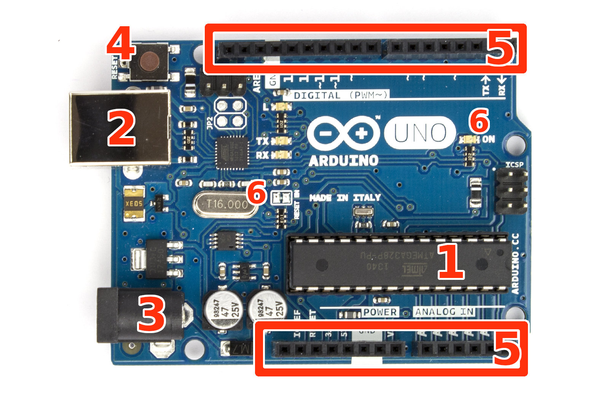

## はじめに

こんにちは、中3のAです。今年で2回目ですね。

さて今年は、Arduino(アルディーノ)というものについて、語りたいと思います。実は、アナログ回路だけでできることには限界があります。例えば、LEDを1秒ごとに点滅させる、という動作をさせるのはと でも難しいです。そんなことを、プログラムで実行してくれるのが、Arduinoです。

ちなみに僕は、電子工作班であり、PC班ではないので、プログラミングは詳しくないので、プログラムについては、ここでは触れないことにします。

## 電子工作の限界

電子工作と聞いて皆さんは何を思い浮かべるだろうか？まあ、僕も中学に入るまで電子工作の“で” の字も知らない身でしたので何も思い浮かばないかもしれません。簡単に説明すると、トランジスタ、 抵抗と呼ばれるような電子部品を使って回路を作り、いろいろな機械を作ることです。

次に、電子工作の限界について説明したいと思います。例えば、ラジオなどの回路は、電子工作だけでできます。私が去年作った壁に沿って走るロボットもできます。しかし、自分の思うように動いてくれるロボットを作るとなると、Arduinoなどのマイクロコンピュータが必要となります。

この違いは何か？それは、ずばり制御するかしないかです。前者2つのものは我々人間が命令しなくても勝手に動作してくれますが、後者はマイクロコンピュータ(通称マイコン)と呼ばれるものを使い、 パソコンでプログラムを書き、それをマイコンに書き込み、それで制御するロボットはとても複雑な動作をさせることができます。例えば5歩働いて1秒止まり、90°回転して10歩動き・・・あるいは、LEDを2つ並列につなげて、それを数秒ごとに交互に光らせるなど。

## Arduino Uno

ところでArduinoって結局何なのか?ずばりマイコンの一種です。プログラムするときの言語もC言語、C++をもとにしているので、最もポピュラーで、使いやすいマイコンだと思います。Arduinoにもいろいろな種類がありますが、一番有名なのがArduino Uno(アルディーノ ウノ)です。

価格は2800円とおそらくArduinioの中でもっとも安価なものだと思われます。ピンの数はdigitalが13本とちょうどいい本数となっています。互換品もたくさん出ていて、マルディーノというマルツ部品屋で売っているものもあります。

「Arduinoを使って工作しよう!」みたいなArduino関連書籍もたくさん出ていますが、その中で使われているのはほとんどArduino Unoと言っても間違えではないくらい多く使われています。ちなみに大きさは大体てのひらに乗るくらいの小さいものです。

### Unoについての説明

それでは、Arduine Unoについて細かい説明をしていきたいと思います。下の画像に番号がふってあるのでその順番で説明します。

1.プロセッサー 
    プログラムの実行や制御を行う中核となる部品です。メインメモリーやプログラムなどを保存しておくフラッシュメモリーも同梱されています。

2.USB ポート 
    USBケーブルを差し込み、パソコンとの間で通信を行うためのものです。パソコンで作成したプログラムをケーブルを使って書き込んだり、Arduinoとシリアル通信を行ってパソコンから制御できます。

3.電源ジャック 
    ACアダプタを接続してArduinoに電気を供給します。

4.リセットボタン 
    Arduino を再起動するボタンです。プログラムを実行しなおしたいときやArduinoの挙動がおかしくなった場合に使います。僕は展示してあるロボットがちゃんと動かなかったときによく押していましたが、リセットというぐらいだから押して、プログラムをもう一度入れなおし、ちゃんと動くものだと 思っていたのに、これを押しても少し動作が止まるだけでした。なので、あまり使う機会はないと思 います。

5.各種インターフェース 
    Arduinoの上部と下部にある、電子回路に接続するための小さな穴の空いたソケットです。それぞれのソケットにはGND,Digital5,5V,Analog0などの役割があります。図の上側は主にDigital, 下側は主にAnalogや5V,3.3Vなどの出力です。

6.LED 
    Arduinoの状態を表示するLEDです。パソコンを使ってシリアル通信をしている時には、TXとRXが点滅します。

## その他のArduino

最後にArduino Uno以外のものを紹介します。これらを使用するときには、ソフトウェアのツールから、ボードを選択して、使いたいArduinoの種類を選択する必要があります。

### Arduino Mega2560

全自動鍵盤ハーモニカ演奏機(?)でも使われているUnoより大きいArduinoです。その特徴は、圧倒的なピン数の多さ。価格は5800円。

### Arduino Due

Megaとほとんど変わらない見た目ですね。はっきりいって値段ぐらいしか違いがわかりません。デジタルのピン数が54本とUnoの4倍です。またUnoの約5倍の処理を行えるそうです。価格は6264円

### Arduino Micro

Unoより小さいものとなっています。このタイプは、ブレッドボードとよばれるハンダ付けなしで回路を作ることができるものに差し込んで、使うものだと思われます。大きさも小さいモノ消しゴム2個ぐらいだと思います。価格は、3893円。

### Arduino Nano

Microよりも小さいArduino。デジタル入出力とアナログ入力の切り替えができないそうです。Microよりも一回り小さくなっていて、これもブレッドボードに差し込んで使うものです。価格は4546円

## 最後に

さていかがだったでしょうか。少しでもArduinoというものについて、わかっていだだけたでしょうか。また興味を持った、電子工作にさらに興味を持ったのであれば幸いです。

今年は部誌に関して特に何も言われてないのでとてものびのびと書くことができました。そして、最後まで読んでいただきありがとうございました。また物理部展2017 にお越しいただきありがとうございました。

## 参考文献
「これ1冊でできる!Arduinoではじめる電子工作超入門改訂第2版」

## ランセンス情報

2022年9月追記：WEB版の発行にあたり、著作権の兼ね合いから画像を一部差し替えました。ライセンス情報を以下に記載します。

* Arduino Unoの写真：oomlout様([画像出典リンク](https://commons.wikimedia.org/wiki/File:Arduino_Uno_006.jpg))、CC BY-SA(表示・継承) 2.0(二枚目の写真はこれを改変したものなので、同じライセンスが適用されます)
* Arduino Mega2560の写真：Adafruit Industries様([画像出典リンク](https://www.flickr.com/photos/adafruit/21986807442))、CC BY-NC-SA(表示・非営利・継承) 2.0
* Arduino Dueの写真：Arduino SA様([画像出典リンク](https://commons.wikimedia.org/wiki/File:ArduinoDue_Front.jpg))、CC BY-SA(表示・継承) 3.0
* Arduino Microの写真：Gekk3様([画像出典リンク](https://commons.wikimedia.org/wiki/File:Arduino_Micro.jpg))、CC BY-SA(表示・継承) 3.0,2.5,2.0,1.0
* Arduino Nanoの写真(互換機のもの)：Tubor Barker様([画像出典リンク](https://www.flickr.com/photos/tudedude/15641941804))CC BY-NC-SA(表示・非営利・継承) 2.0