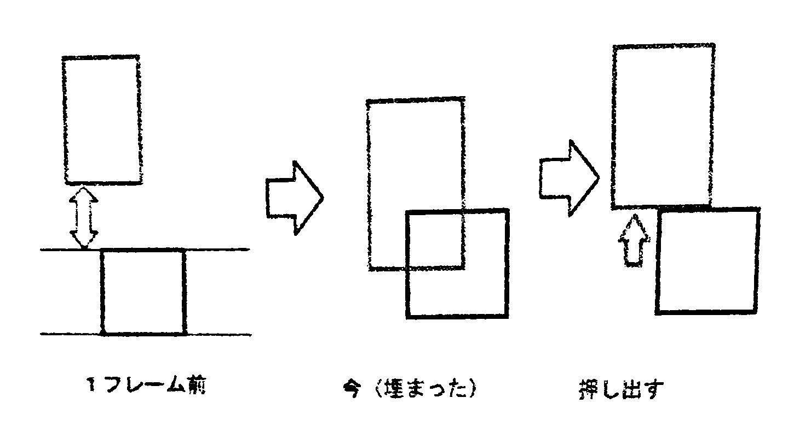
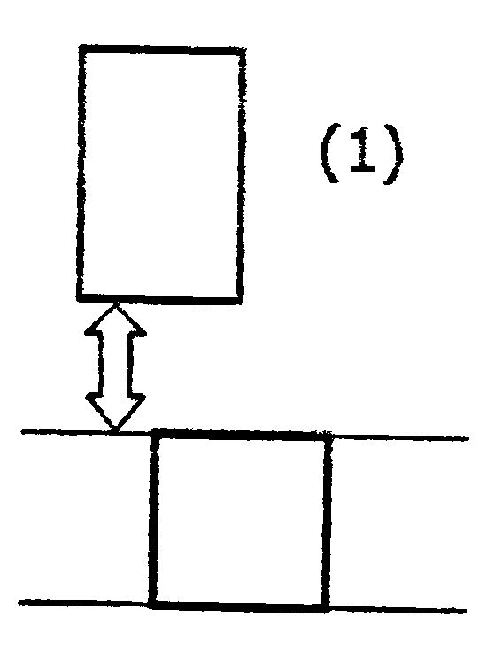
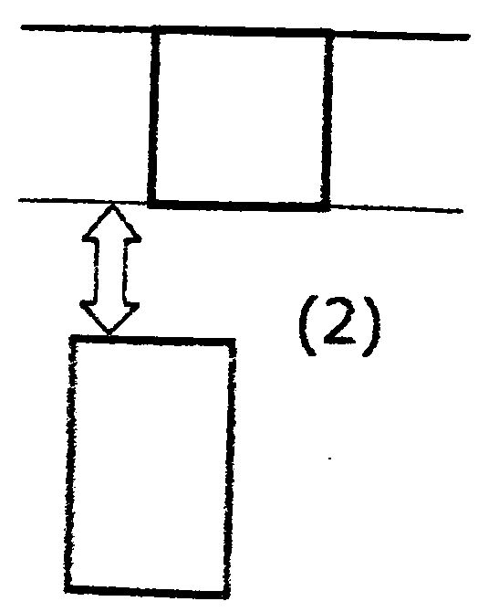
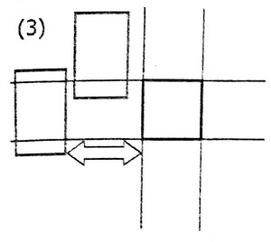
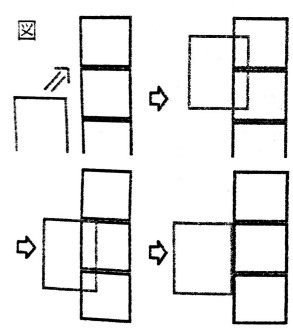

こんにちは。ここでは、2Dのアクションゲームがどのように動いているか、簡単に見てみたいと思います。ここで説明しているのは、2Dのアクションゲームを作るにあたって、ほぼ自分で考えたものなので、実際の物とは全く異なるかもしれませんが、どのようにゲーム が動いているのか少しでもわかってもらえればと思っています。

## フレームとは？

まずは、「フレーム」について説明します。

実は、パソコン・スマホ・テレビなどの映像は、1秒間に数十枚の画像を表示して、動いているように見せています。ゲームでも、1秒間に60枚の画像(1枚あたり1/60秒)を入れ替えることが多いです。そして、その1枚1枚の画像のことを、「フレーム」といいます。ふつう、ゲーム内では、1/60秒の間に次の画像を用意して、1/60秒経ったら入れ替えて・・・ということを繰り返しています。

## 落ちる動きについて

次に、重力について説明したいと思います。

例えば、ゲームで高いところから落ちると下に落ちますよね。この動き方を作るのは簡単そうに思えますが、実は少し難しいのです。 単純に、1フレーム当たり1ずつ下に落とすようにすると変な動き方になってしまいます。物を落としたとき、加速度は一定だから、物 体の速度は時間に比例して大きくなっていくので、1フレーム目は1、2フレーム目は2、3フレーム目は3ずつ落ちるようになります。そうすることで本当に落ちているように見えます。では、ジャンプもさせてみましょう。1フレーム目は10上に、2フレーム目は9上に、11フレーム目は0、12フレーム目からは落ちる動きと同じようにしてみると、うまくジャンプできます。

(少しプログラミング的なことを言うと、例えば、重力の変数gを用意しておいて、gには1フレーム当たり0.3ずつ増やし、プレイヤーのy座標に1フレームずつgを足して、ジャンプのキーが押されたときにgを-20にするとジャンプができます。)

## 当たり判定について

最後に、当たり判定について説明したいと思います。

当たり判定と言っても色々ありますが、ここでは、1つの正方形のブロックと、長方形のプレイヤーとの当たり判定について説明していきます。これも、簡単そうに見えて実は難しいのです。どうしてかというと現実世界では、ものが動くとき、連続的に動きますが、ゲームでは1/60秒ごとにプレイヤーを動かしているので、連続的には動きません。プレイヤーがブロ ックに当たったら止めるという処理だけだと、ブロックに埋まってしまいます。そこで、ブロックに埋まったら押し出すという処理が必要になります。ここでは、その押し出しをどのように実装したか、説明したいと思います。

まず、あるフレームでプレイヤーがブロックに当たったとしましょう。その1つ前のフレームで、プレイヤーがどこに居たかで場合分けをします。

(1)1つ前のフレームで、ブロックよりも上にいた場合

この1フレームの間に、ブロックの上側の辺に当たった可能性が高いので、プレイヤーをブロックの上側に持ってくる。

(2)1つ前のフレームで、ブロックより下にいた場合

この1フレームの間に、ブロックの下側の辺に当たった可能性が高いので、プレイヤーをブロックの下側に持ってくる。

(3)それ以外のとき(図の2本の横線のどちらかにあたっていた、またはその間に入っていたら)

〈1〉1つ前のフレームで、ブロックより左側にいたら

この1フレームの間に、ブロックの左側の辺に当たったのプレイヤーをブロックの左側に持ってくる。

〈2〉1つ前のフレームで、ブロックより右側にいたら

この1フレームの間に、ブロックの右側の辺に当たったので、プレイヤーをブロックの右側に持ってくる。

〈3〉それ以外のとき(1つ前のフレームも埋まっていたら)1つ前のフレームで埋まったのに押し出せていない?

このような場合分けをしてみたところ、それっぽく動きました。

では､ブロックがたくさんあるときはどうでしょう。単純に、それぞれのブロックに対して同じことをすると、例えば図のようにプレイヤーが動いたとき上の当たり判定の方法でやって見ましょう。一番上のブロックで押し出しをやってみると、1フレーム前のプレイヤーは一番上のブロックより下にいたので、ブロックの下側に持って行きます。そして、二番目のブロックでは、1フレーム前のプレイヤーは左側にいたのでブロックの左に持っていきます。すると、ブロックが縦に並んで壁のようになって、左側にしか当たりそうにないの に、その壁のブロックに頭をぶつけたようになってしまいます。

そうならないように、ブロックがたくさんある場合は、先にすべて左 右の当たり判定をしてから、そのあと、すべての上下の当たり判定をします。

というわけで、少し説明してみましたが、どうでしたか。分かりにくいところもあったと思いますが、少しでも、ゲームがどのように動いているのか興味を持ってくれたらうれしいです。ここまで読んでいただきありがとうございました。