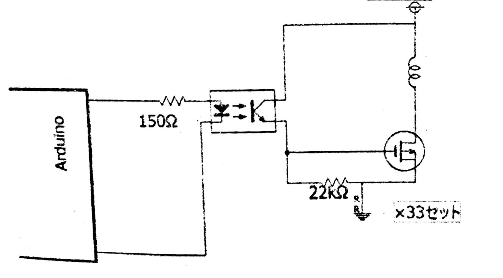

今回は今年作った「自動演奏装置」について書いていきたいと思います。去年作ったリコーダーのリベンジですね。去年に比べてそれなりのものができたと思います。いやぁ、去年は酷かった。ずっと尺八吹いてるみたいな感じになってしまいました。教師にもその後の授業でなんか言われるしあれでしたんで

今年は色々と改善...というか根本から見直しして作り直しました。まあ、ともかく物理部展#2017をよろしくお願いします

## 製作動機

一番は去年のような無様な真似はしたくないというのが一番でしょう。去年の敗因はリコーダーの穴をしっかり抑えられなかったのと、空気をただ吹き込んでも音が出るということだと思います。それを防ぐために、もっとも効果的な策はリコーダーを諦めるということでした。というか去年とある動画を丸パクし過ぎました。

そこでたどり着いたのが「メロディオン」です。空気をただ流し込んでも音もでない、鍵盤超押しやすい、和音もでる。リコーダーに何一つ劣っている点がないね！！

というわけで、メロディオンを用いた自動演奏装置を作ることに決めたのです。

## 材料

* ソレノイド × 32個
* 2SK2233 × 33個
* 150Ω × 33個
* 22kΩ × 33個
* リレー × 1個
* TLP627-4 × 9個
* Arduino Mega 2560 × 1
* エアーコンプレッサー × 1
* メロディオン × 1
* 木材 × 適量
* バルブ × 2個
* PC x 1個
* 愛情 × <ruby>∞<rp>（</rp><rt>ムゲンダイ</rt><rp>）</rp></ruby>

### 部品の説明

ソレノイドとは、電磁石の力で鉄の棒を上下させる部品です。鍵盤を押す部品ですね。2SK2233はトランジスタ(のようなもの)です。Arduinoから出力される電流が小さいのでそれを増幅する部品です。150Ω、22kΩは抵抗です。電流の勢いを落とします。安全装置ですね。リレーは遮断装置です。バルブに流す電流がすごいので、それを使って処理回路と遮断します。

TLP627-4は安全装置です。Arduinoは繊細な部品なので、それを守ります。Arduino Mega2560は処理装置です。PCから出力された音楽の信号を電気信号に変えます。エアーコンプレッサーは空気送り機です。メロディオンに空気を供給します。メロディオンは楽器です。愛情は説明不要でしょう。愛なくしては原因不明のエラーに耐えられません。

## How to 動作

パソコンで楽譜データを数字に変換(俗に言うMIDI)し、その数字をArduinoに送り、Arduinoでこの数字のときはドの音、この数字のときはレの音......と先に教えておいて、その数字が来たら、その音を出す鍵盤を押すソレノイドに信号を出します。

実際はArduinoとソレノイドの間には安全装置と増幅装置を挟んでいます。後、和音のときや極端に低い音の時などはバルブにも命令を出し、流れる空気の量を増やすようにしています。

## 回路図



## Anduino に書き込んだプログラム

```c
#include <MIDI.I>
#include <Servo.h>

Servo servol;

int Pin[54]={};
unsigrred long DownTime[54]={};
int Channel;

MIDI_CREATE_DEFAULT_INSTANCE();

void setup(){
    servolattach(7);
    for(int i=22;i<=53;i++){
        pinVode(i, OUTPUT);
    }
    MIDI.begin();
    Serial.begin(115200);
}

void loop(){
    midireadplay();
}

int GetPinNum(int NoteNum){
    if(Note Num<53){
        return (NoteNum+7)%12+22;
    }else if(NoteNum<=84){
        retum Note Num-53+22;
    }else{
        retum (Note Num-85)%12+42;
    }
}

int GetMicroDeg(double Deg){
    Deg+=10;
    if(Deg<0)Deg=0;
    if(Deg>180)Deg=180;
    int minw=MAX_PULSE WIDTH;
    int maxw=MIN_PULSE_WIDTH;
    retum minw+Deg*(maxw-minw)/180;
}

void midireadplay() {
    MIDI.setInputChannel(t);
    if (MIDI.read()){
        uint8_t datal = MIDI.getData();// note no
        uint8_t data2 - MIDI.getData2(); // velocity
        int PinNum=GetPinNum(datal);

        switch (MIDI.getType()){
        case Ox90:
            if (data2 = 0){
                digitalWrite(PinNum LOW);
                Pin[PinNum]=0;
            }else{
                digitalWrite(PinNum,HIGH);
                Pin[Pintum]=1;
                DownTime[Pinhum]=millis();
            }
            break;
        case Ox80:
            digitalrite(PinNum,LOW);
            Pin[PinNum]=0;
            break;
        }
    }

    //長い間下がっているピンを上げる
    for(int i=0i<54j++){
        if(Pin[i]==1&&DownTime[i]!=0&&millis()-DownTime[i]>10000){
            digitalWrite(i,LOW);
            Pin[i]=0;
        }
    }
    //下がっているピンの数を数える
    int OnPinNum=0;
    for(int i=0;i<54;i++){if(Pin[i]=1){OnPinNum++;}}

    servol.writeMicroseconds(GetMicroDeg(OnPinNum*8));
}
```

## 後書き

え～、長々と興味の無い人には本当につまらない話をしてしまってすいませんでした。あ、ここまで目を通す人は興味のある人しかいないから大丈夫かな。私にとっては最後の文化祭であり、動画から発想を得た以外は基本的に自分で考えた作品を作れたので満足です。(とっても簡単なんですけどね...)

物理部展#2017にお越しいただき誠にありがとうございます。また来年、来て頂けるとうれしいです。