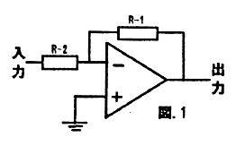
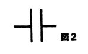
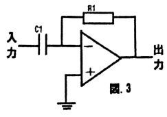
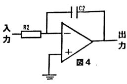
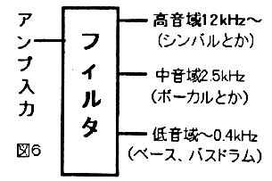
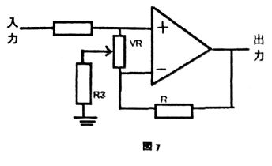
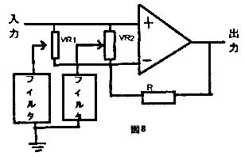

おはこんばんちわ。今回はオペアンプを使用したバンドパスフィルタ(特定の周波数の波だけを通すフィルタ)の仕組み、また、その仕組みを利用したオーディオ関連の道具の設計について紹介したいと思います。

## オペアンプって何だ?

(図1を参照のこと)三角形の部分がオペアンプを表しています。これはオペアンプ回路の基本的な使い方なのですが、その機能は入力された信号が$R_1/R_2$倍された電圧で出力されるというものです。この、どれだけ電圧が大きくなるかの数値を利得といいます。

当然、$R_1$の値が0になれば利得も0になります。

## コンデンサの性質

(図2は回路図での表し方)

コンデンサには“特定の周波数より高い波を通し、低い波を通さない”という性質があります。周波数が低くなるとともにインピーダンス(電気の通しにくさ)が大きくなり、高くなるとインピーダンスが小さくなる、つまり周波数とインピーダンスは反比例の関係だということです。インピーダンスが増加する周波数はコンデンサの容量によって変化し、容量が小さいと高くなり、容量が大きいと低くなります。

### 微分回路

それでは、ここで図1の$R_2$がコンデンサ($C_1$)に置き換わった場合を考えましょう(図3参照)。うえで述べた$“利得=R_1/R_2"$が$“利得-RI/(C_1のインピーダンス)”$となるわけです。分母となる$C_1$のインピーダンスが周波数によって変化するわけで・・・ 
周波数高→インピーダンス小→利得大 
周波数低→インピーダンス大→利得小 
というように、周波数が高いほど利得もも大きい回路になるわけです。これを分回路といいます。

### 積分回路

微分回路とは逆の回路だと考えれば良いです。今度は$“利得=(C_2のインピーダンス/R_2)”$となり・・・ 
周波数高→インピーダンス小→利得小 
周波数低→インピーダンス大→利得大 
というように、周波数が低いほど利得が大きい回路になるわけです。これを積分回路といいます。

## フィルタとして使おう(*^^)v

例えば、色々な周波数が混ざった信号があるとき、微分回路をつかえば特定の周波数より高い信号だけを増幅することが出来ます。つまり、高い周波数だけを選択して取り出すことが出来るのです。このような使い方を“ハイパスフィルタ”と呼びます。 反対に、積分回路を使って低い周波数の信号だけを取り出す使い方を“ローパスフィルタ”と呼びます。ハイパスフィルタとローパスフィルタを組み合わせることで、特定の周波数だけを取り出すことも出来ます。この使い方はバンドパスフィルタと呼びます。

## 応用例その1 “バンド別レベルメーター”

音楽などのオーディオ信号には、低音域から高音域まで幅広くいろいろな周波数の音が混ざっています。たとえば、その中から特定の楽器の音だけ取り出したいとき、バンドパスフィルタを使うことでその楽器の周波数の音だけを取り出すことができます。このとき、近い周波数を持つほかの楽器の音も取り出してしまうのですが、聞いているうえではそれほど気になりません。

図6のように、増幅したオーディオ信号をフィルターを使い3つの音域に分け、それぞれをレベルメーター(音量を光で表す装置)につなげたものが“バンド別レベルメーター”です。低音域ではバスドラムにあわせて、中、高音域ではそれぞれ歌声やシンバルの音にあわせて光がちらちら動く、というような見ていて楽しめる装置です。

今回の文化祭で作品として展示してあるので見ていってください。

## 応用例その2”グラフィックイコライザ”

フィルタを使うことで信号の好きな音域だけ増幅することもできます。まず、図7のような回路を考えてみましょう。このとき、ボリュームを調整すると利得を変えることができます。では $R_3$をフィルタに置き換えてみましょう。そうすると、フィルタが通す音域だけの利得を可変できる回路になります。また、異なる音域のフィルタを並列させることで、いくつもの音域の利得を同時に調整するころもできます。(図8を参照)

このように、ボリュームをいくつか並べてオーディオの信号を変えられるようにする機械がグラフィックイコライザです。また、並列するフィルタの数に応じて”〜バンド別イコライザ”という名前になったりします。

## まとめ

このように、オペアンプにはさまざまな使い方や活用法があります。まさにアナログオーディオにとっては欠かせない存在です。この記事を通して、アナログ回路、自作オーディオ(そして電子工作班!)に興味を持っていただけると嬉しいです。

実をいうと、いままで紹介したような回路は現在のオーディオ分野ではほとんど使われていません。というのも、今日ではほぼすべての機器がデジタル制御できるようになっているため、アナログ回路は必要なくなっているからです。また、アナログ回 路にはノイズが入りやすい、放熱が必要、等の欠点もあります。

そんなアナログな機器は入手することができません。つまり、自作するしかないということです。

以上、マイナーな趣味の話でした。
