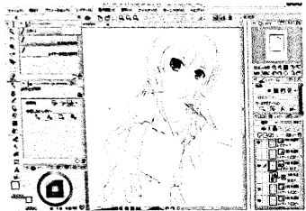
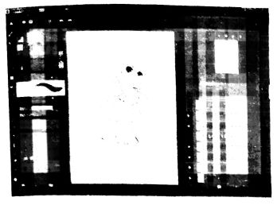

こんにちは。物理部で主に会計などの事務作業をしておりますI.H.です。まあ、事務専門でありますのでそこまで物理部らしい専門的な話はできませんが...。この紙面ではパソコンで描画をするとき使用するソフトについて解説したいと思います。

## パソコン上での描画に使用する主なソフトについて

皆さんはパソコンで描画をしたい時...どのソフトを思い浮かべますか。多くの人はWindows標準搭載のペイントを思い浮かべるのではないでしょうか。単純な図形であればペイントでもかまわないかもしれません。それではグラデーションをかける、など複雑な作業をしたいときは?このときに使用するソフトとしては Photoshop Gimp2.0 があげられます。ほかにもペンタブレット(パソコン上で手書きで描写するための周辺機器)で紙に描くような絵をパソコンで描画したいときには、ClipStudioPaint , SAI , Pixia ,MediaBangPaintPro などがあげられます。

## 画像加工ソフトについて(photoshop Gimp2.0)

ここからは各種ソフトの説明を簡単にしたいと思います。

### Photoshop

画像加工ソフトの中で最も有名なソフトです。このソフトはビットマップ画像という、画像をドットという小さな色の点の集まりで現した画像を編集するのが主な機能です。ですので線で描画する絵ではなく、このソフトは写真や背景などの素材画像作成、全体的な色味やトーンの調節に向いています。グラフィックデザイナーやWEBデザイナーのプロが使用するほどの充実した機能とパフォーマンスを兼ね備えたソフトですが、価格はPhotoshop CCで月額使用料3980円(デザイナー向けコンプリートプラン)、家庭向けのPhotoshop elementsですら税別9800円と、非常に高額であるのが難点です。また、(あくまで個人的な実感ですが)機能が複雑な面もありソフト使用技術の習得には若干時間がかかります。

### Gimp2.0

画像加工ソフトの中でもPhotoshopと同様に非常に著名なソフトです。Photoshopと同様、背景などの素材画像や写真の編集に適しています。しかし、なんとこのソフトはフリーソフト、無料で使用することができるのです。また、有料の画像編集ソフトと引けをとらない高機能で多くのユーザーを今日までに引き寄せています。ただ、このソフトの悪い点を上げるとすれば、ソフトの起動の際に多くのデータを読み込む?らしく、パソコンのメモリが不足していると正常に動作しないところです。もし自前のパソコンでGimpが起動できない場合はその軽量バージョンであるGimp Portableを使用することをお勧めしま
す。(ただし機能は若干削減されています。)

## 線画描写ソフトについて(ClipStudioPanit など)

### ClipStudioPaint

このソフトはドットの処理が可能なレイヤーであるラスタレイヤーのみならず、画像を座標やベクトルの概念を用いて表すレイヤーであるベクターレイヤーを扱うことができます。ベクターレイヤーでは拡大縮小を行っても画像の解像度が損なわれないため、線画(線のみの画像)の描写に適しています。また、ペンタブレットの筆圧を反映することができます。価格が税込 5000円と安価である一方、3Dデッサン人形をパソコン上で扱えるなど機能は非常に多彩で、コストパフォーマンスが非常に高いソフトです。ちなみに、Amazonや家電量販店での売り上げでは2015年から3年連続で一位を記録しています。

### SAI

このソフトは先のソフトと同様、線画の描画と画像処理を行うことができるソフトです。価格は5400円(税込)で、動作は比較的軽く、書き心地もよいので多くのユーザーがら支持を得ているソフトです。ただし、かなり前からソフトの更新がされていないようなので、現在販売されているソフトと比べて、機能が若干古めであったり、少ないといった印象をうけてしまいます。

### Pixia

このソフトは無料で配布されている、線画の描画と画像処理を行うことができるソフトです。ツールが文字ではなくアイコンで大きく表示されているなど、操作画面が初心者にとっても非常にわかりやすく、フリーソフトであることもあって、デジタルイラストの入門用ソフトとして定評があります。

### MediaBangPaintPro

このソフトも同じく無料で配布されている、線画の描画と画像処理を行うことができるソフトです。操作画面は比較的わかりやすく、動作も軽いことから多くのユーザーから指示がありますが、ペンタブレットで描画する際の動作は有料ソフトと比べてあまり滑らかとはいえません。

## 総括

主な画像処理ソフト、線画描写ソフトの説明は以上です。自前のPCの諸事情により、GIMPとPhotoshopの操作画面を掲載することはできませんでした。なお、編集中の画像は自作のものであるのですが、使用してて線画ソフトの中で個人的に最も使いやすいソフトはClipStudioPanitでしたね。有料のものと無料のものの間では圧倒的な質の差があるのは否めません。ただより安い飯はありませんが...。ただ、有料のソフトはどれでも無料体験版をダウンロードすることができるので、ソフトの購入を検討される際はフリーソフトとの比較をしつつ、無料体験版の試用をお勧めします。紙面の都合上、説明を簡略化した箇所や詳しい説明を控えさせていただいた箇所がありますがご了承ください。一部読みにくい箇所もあったかとは思いますが、最後までお読みくださってありがとうございました。

(文責:IH)