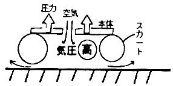
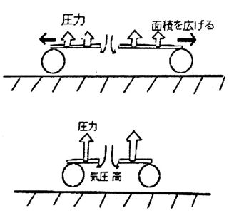
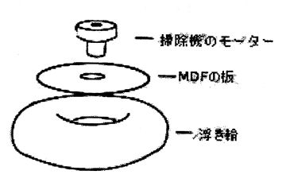
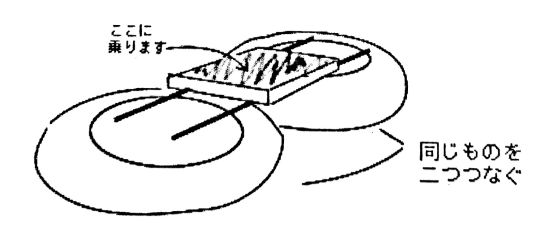

ここでは、特殊な機材などを使わずにどの家庭にもあるパーツを使って“人が乗れるホバークラフト”を作っていきたいと思っております。

## そもそもホバークラフトとは何ぞや？

空気の圧力で浮上して移動する乗り物である!

## ホバークラフトの原理

(下の図を主に参照して理解してください。)

本体とスカートでつくられた隙間に空気を送り込みます。隙間の気圧が高まります。すると、空気圧によって本体が持ちあげられます。このとき、スカートと地面にほんのしこし間が空き、スカート内の空気が漏れだしますが、少量なのでスカート内の気圧にはそれほど影響はありません。

## 製作における注意点

原理に則って考えると、スカートを水平方向に広げ、空気圧を受ける面積を大きくすると本体を持ちあげる力も大きくなります(格好良く言うとパスカルの原理のことです)。また、スカート内に空気を送り込む圧力を強めるとスカート内の気圧は高くなり、持ち上げる力は大きなります。

スカートは地面との隙間を小さくするために地面と密着する必要があります。

## 設計!!

「まず、スカートに使う素材を決めます。上記の理由により地面と密着できるようにするには、柔らかい素材にする必要があります。また、上記の通り出来るだけ大きいものが良いです。そこで、120cm の大人用うきわを使うことにしました。

次に、空気を送り込む機械を決めます。これはある程度の風量があり、強い圧力をつくれるものが良いです。ここでは、掃除機に使われているモーター及びファンを使います。掃除機を分解すれば簡単に入手できます。実は、掃除機のモーターというのは非常に便利な代物で、家庭100v電源で稼働できる上にファンと一体になった構造をしているのです。掃除機のファン及びモーターは掃除機の構造上、強い圧力をつくれるようにできています。まさにホバークラフトにぴったりではありませんか!

## やっと製作に取り掛かります

巨大うきわに図1の本体となる板を取り付け、モーターを取り付け、補強をします。同じような物をもう一つ作り、二つをつなげて完成です。空気もれがないように注意しましょう。(実際の作業は木工というあまり物理らしくないものなのでここでは割愛します。)

## そして起動!!

モーターを交流電源に並列につなぎ動かします。フワフワと床の上を浮いています。手で押してやると何の抵抗もないようにすいすいと進みます。さっそく乗ってみましょう。板に座り後ろから押してもらう。上手く進まない。

## 問題点

掃除機のファンが生み出す気圧はおよそ0.25気圧($25\mathrm{kPa}$)です。ホバークラフトの気圧を受ける面積は二つ合わせて $0.8\mathrm{m^2}$ です。$25\mathrm{kPa} \times 0.8\mathrm{m^2}=20\mathrm{kN}=約2000\mathrm{kg}$持ちあげる力がある計算になります。

そんな大きな力があるにもかかわらず人が乗ると動かなくなってしまう。なぜ?・・・どうやら左右のバランスが悪く、片側から空気が漏れもう片方が地面についてしまっているようです。板の上に重りを乗せたときは動いていました。また、バランス感覚の良い人が乗った時も動いていたので、やはり左右のバランスが問題です。

解決策としては“うきわを3個搭載した形状にする” “バランス感覚を鍛える”等がありますが、時間や予算の関係であしからず・・・。

以上、ホバークラフト製作記でした。
