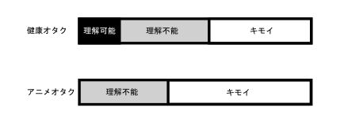
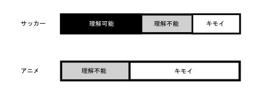
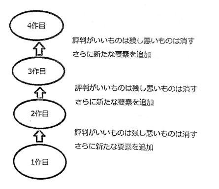

## 前書きみたいななんか

いきなり分けのわからないタイトルだが気にしないでほしい。筆者自身もそう思っている。タイトル通り「オタクと呼ばれるもの』について語ろうと思う。

## オタクの定義

オタクとは何か。この論題については今までに多くの論争が起こってきた。

“オタク”と置いて最初に思い浮かべるのは何だろうか。アニメオタク、アイドルオタク、鉄道オタク。まあ、この3つを思い浮かべる人が多いだろう。中には健康オタクなどの他の〇〇オタクを思い浮かべる人もいるだろう。だが、この相違は『オタク』の本来的な意来からの乖離のよって生まれる。

オタクの本来的意味とは何か。これははっきりしている。1983年、『漫画ブリック』において、『「この頃やたら目につく世紀末的ウジャウジャネクラマニア少年達」「友達に「おたくら さぁ!」なんて呼びかけてるのってキモイと思わない?」と評し、「彼らをおたくと命名する」』と蔑称、名詞として使われ始めた。このように『オタク』とはもともと軽蔑の意味を持つ言葉である。

反対に、健康オタクなどのマイナスイメージが極端に大きいわけではない『オタク」を思い浮かべた人は、かつてあった『オタク』という蔑みの意味を持つ言葉に縛られていない人物だ。本来の意味とは異なった使い方ではあるが、寧ろ良い傾向だ。

『オタク』が蔑称として用いられたのは20世紀までであり、最近ではこのような蔑みの意味が薄い「オタク』が表に出てきている。このように最近では『オタク』というものはかつてとは違い、言葉の持つ意味が多様化し、ある程度社会に浸透し一般化してきた。

本題に戻ろう。『オタク』の定義だが簡単にそういうものとするのは困難だ。語源から考えると『気持ち悪いやつら』となる。だが最近言われるようになってきた『オタク』たちは必ずしもそうではないだろう。「気持ち悪いやつら』ではなく、『理解に苦しむ奴ら』の意味合いが強くなってきている。冷静に考えてほしい。例えば健康オタクとアニメオタクについて比較してみよう。

このグラフは私の個人的な偏見を織り交ぜた一般人から見た両者の違いを表したものだ。この2つの最大の違いは理解可能領域の有無だ。長さは知らん。この理解可能領域は『へー、ふーん。あぁなるほどそういうことね』程度には理解できる領域を表す。全く健康に興味がない人なんてほとんどいないだろう。ちょっと行き過ぎてる気もするけどわからなくもないと思えるレベル、それがこれだ。対してアニメオタクゲージにはそれがない。考えてみてほしい。自分がまったく興味ないどころか初めて聞いたことについて語りだす人間を。理解するしない以前に関わりたくないと思うだろう。だがどちらも行き過ぎれば気持ち悪いというのは共通している。

まとめると、『オタク』の定義は”興味ない人からしたら理解しがたい人々”ということ になる。

さて次はオタクが対象とする趣味について考えよう。どんな趣味なら『オタク』でありどんな趣味なら『オタク』ではないのか。

これは一言で言えば『マジョリティかマイノリティか』ということである。

たとえば、アニメとサッカーで考える。サッカーは間違いなくマジョリティだろう。WCや国を挙げてのイベントだ。それに生きてきて一切サッカーに関係しなかった人はほとんどいないだろう。WCの時期はテレビをつけると大体関係したことが取り上げられている。サッカーは誰でも知っている、ということになる。それはさておき、サッカーはマジョリティというのはいい。アニメはどうだろうか。最近は多少は浸透してきたとはいえそれでもまだマイノリティだろう。

ここでこの図だ。前述のモノとほぼ同じものだ。ここで理解可能領域に注目してほしい。マジョリティとマイノリティの最大の違いはこのゲージの有無だ。この図からわかるように、マジョリティは理解される、という点が大きい。少しばかり行き過ぎても自分も少しは知ってるから......とある程度は理解される。この辺りは前に述べたので省く。

マジョリティとマイノリティの境は個人の基準だ。誰でも理解できる、という点で区切るのがいいかもしれない。もしくは初対面の相手に対する自己紹介の際に言えるかどうか、でもいいだろう。

どこからが『オタク』なのかについてはまた後ほど。

ようやくまとめに入ろう。『オタクの定義』とのことだが、

* 意味の対象がマイノリティ
* マジョリティでも英味がない人からすれば気持ち悪いレベル
* 『マニア』も『オタク』の範囲内

ということである。

## オタクレベルと日常生活

ここからは、何事も程度が大切である、ということについて語る。

ここでは主にサッカーとアニメ、この2つから見ていこうと思う。

まずはレベル 0。というか普通の人。サッカーならばテレビで放送してることに気づき、気が向いたら見る、アニメも同じ。興味ないわけじゃないけど能動的ではない、というような感じ。尚、アニメとは深夜以外も含むことにする。日常生活には一切影響はない。

レベル 1。サッカーならばテレビでやっているなら見る。さらに好きなチームあるわけではなく『サッカー』そのものが好き。アニメならば好きな漫画などがアニメ化したら興味を 持つぐらい。この程度まではまだまだ普通。アニメの方は人によっては理解不能になるかも。それでも普通の人でもこのぐらいだと思っている。

レベル 2。サッカーなら好きなチームができたり、選手ができたりするレベル。そのチームの試合や選手が出る試合は前日からチェックしたりもする。アニメならその時期に放送しているアニメの中から興味のあるものを選んで見るレベル。人によってはこの時点でオタク認定が始まる.....のか?もう少し早いかもしれない。流石にアニメを見るだけでオタク認定する人には何も言えない。このレベルは興味ない人にでも理解してもらえるぐらいだろう。 理解してください。

レベル 3。 サッカーなら好きなチームの試合が近くであるのならスタジアムにいき観戦するレベル。人によってはグッズを買ったりもするだろう。アニメならば好きな『声』ができたり、『絵』に対しても注目するようになり、ただのアニメ観賞から一歩進む。このあたり から日常生活にも影響が出てくる。話題としても十分通用するぐらいだろう。とはいっても、軽くだが。

レベル 4。サッカーなら好きなチーム試合があるならどれだけ遠くても行こうと努力する レベル。人によっては応援団の一員になっている。アニメならワンクールあたりに見るアニメの本数が増え、グッズの購入が増加したりする。日常生活にかなり影響が出る。ここまでくれば立派なオタクの一員と言える。

レベル 5。 末期。サッカーなら日本代表サポーターとして海外にまで行く。アニメなら生活費を切り詰めてまでグッズを買ったりする。ここまで来たらもはや日常生活に影響が出る以前に趣味の合間に生活するか、趣味が日常になる。もはや気持ち悪い領域に入る。

上記に書いたのはあくまでも一例かつ偏見であり色々と言いたいこともあるだろうが、ご了承願いたい。

日常生活に影響がある、といっても人それぞれで個人差がある。アニオタのなかでも結構深い方にいるのにグッズはあまり持たずに、イベントにもあまり参加しない人もいる。逆にあまり深くはまっていないのに大量にグッズを買ったりイベントに行きまくる人もいる。日常生活への影響は趣味への深度よりも個人がどのように趣味と生活を分けているのかが関係している。

『オタク』と日常生活への影響を語るうえで『NEET』や『ひきこもり』との関係性は欠かせないだろう。『オタク』と聞けばそれらを思い浮かべる人も決して少なくないだろう。それは間違っていない。確かに『NEET』や『引きこもりは』そのほとんどが『オタク』に分類 される。だが必ずしも『オタク』が『NEET』や『ひきこもり』になるわけではないと認識してもらいたい。

『NEET』や『ひきこもり』になりやすい『オタク』もいればなりにくい『オタク』もいる。中にはそうなることを危惧してアニメやラノベなど一切触れさせようとはしない親がいるだろう。だがそれは悪手でしかない。そのように押さえつけられてしまうと将来独り立ちした際に一気に解放されてしまう。そうなると自分で稼いだ金ということもあり歯止めがきかず、どんどんと深みにはまってしまう。押さえつけられていた故の反発が起こってしまう。そうなると日常生活にも影響が強く出るようになる可能性がある。対して幼いころからアニメや漫画に触れ、制限されなかった場合はというと、中学、高校あたりでピークを迎え、多少下がって落ち着く。グッズを買う金があったとしても制限があり、欲しいものをすべて買ってはすぐに底をつく。そのため浪費はあまりせず、大人になってもイベントなどのために節制するようになる。中学生、高校生のころから趣味と生活を分けて考えさせることが重要だ。『NEET』や『ひきこもり』にしたくないというのなら押さえつけるのはあまり得策ではない。さらに親がそのような趣味に対して理解があるのならば、親子間のコミュニケーションツールとしても機能する。日常生活云々はどれほどの深度にいるかではなく、個人の精神的な問題の方が強いのではないだろうか。 

## ここからが本題 ◆ オタクはなぜ 「オタク』なのか

『オタク』とは決して好まれるものではない。『キモオタ』という言葉があるとおり、『オタク』は気持ち悪いものであるといった悪感情は存在する、ではなぜそのように思われるのだろうか、それを考えていこう。

### 見た目

なんといっても見た目は重要だ。初めの印象に大きく関わってくるところだ。普通ならば見た目に多少は気を遣うだろう。だがオタクはそうではない。

まずは服装だ。『着られればいい』『服を買う金がない』そんな理由で服を買わない。いや、オタク以外だってそう言う人はいるだろう。しかし、オタクはあまり服に対して関心がないのは恐らく『普通』がおかしいからだろう。学生のころから同じような趣味の相手とだけ関係を持つとこのようなことになってしまう可能性がある。

### 痛〇〇

痛車、痛スマホ、痛T......あげればキリがない。街中で痛車を見るとすごいと思うのもあれば「うわぁ...」となるものも多い。オタクではない人やオタクでも公私ではっきりと分けている人からすればかなりのインパクトがある。一部のオタクにはこういった類のものを所有したがる傾向がある。

このようにオタクに対する印象が悪くなってしまう原因は多数存在する。

## オタクと精神論

『オタク』を精神的な意味で考えていこう。

『オタク』にはよく『地雷』と呼ばれるものが存在する。ある特定のことについて、触れられたくないことを不用意に触れてしまうと逆上したりすることだ。『オタク』に限らずほとんどの人にはあるだろう。だが『地雷』というと何かと『オタク』が怒ることをさす場合が多い。なぜだろうか。ここには人間としての本質がかかわってくる。

人間の本質とは何か。それは『否定』であると考える。「いや、それは違うんじゃないか」と思った時点で当てはまる。『疑問に思う』という行為は軽度の『否定』であるからだ。『オタク』はよく人の話を否定する、と言われることがある。それは正しいが何も『オタク』に限った話ではない。人間ならすべて当てはまる。自分の意見を持つ、ということはすなわち相手の意見を『否定』するということだ。『オタク』がよく人の話を否定する、と言われるのはこの『否定』が『全否定』だからではないだろうか。

では『全否定』と『部分否定』の違いは何か。『全否定』は文字通りすべてを否定するということだ。それはつまり他人の話を聞かない、意見を取り入れない、ということだ。対して『部分否定』はどうかというと逆だ。他人の意見を全肯定するわけでもなく全否定するわけでもない。他人の意見で共感できる部分や自分にとってプラスになることを吸収し、自分または大多数にとってマイナスになる部分は否定する。それが『部分否定』だ。この部分否定は自分の意見の昇華につながることになる。

『地雷を踏む』と呼ばれるのはそんな『全否定』をたたきつけているのと同じことだ。そんな意識は全くなくとも、受け取る側にとっては全否定されている気分になっている。『地雷』を踏まないためにはいろいろと工夫しなければならない。

この『否定』だがアニメが年に何十本も出ている理由でもある。それまでにあったアニメを『部分否定』し、また別の要素を入れることで同じようなジャンルの愛好家やそれ以外からも新たに引き込むことができる。そのようにどんどんと新しい、限りなく理想に近いものがどんどんと出てくるため、『オタク』は泥沼から抜け出すことが難しい。シリーズ物はそれが顕著に表れる。

おおむねこんな感じ。これが続くことで古参にも新規にも対応したものが出来上がる。

この『否定』は理解することにもかかわる。『理解不能』とはつまり全否定である。趣味の否定は駄目だと先ほど述べたが、それが『地雷』だ。ここで『部分否定』とはかなり効果がある。ある程度は容認するが、限度はある。そんな対応が一番いい。また、他の『部分否定』の一例として『無関心』がある。この無関心というのが一番多い『部分否定』かもしれない。それはそれ、これはこれの精神で行こう。

これで最後、『精神論』だ。

『精神論』、つまり気合と根性のことだ。気合と根性、あわせて根気。『オタク』の中でも アニオタがいろいろ言われるのはこれも原因の一つだ。

アニメを根気よく見続けているといえばいえるが、アニメとはとてつもなく多いジャンルを総合して『アニメ』と言っているだけである。先ほどはサッカーとアニメを対比していたが、アニメはいわば『スポーツ』のくくりと同じぐらい広いものだと思ってほしい。さらにアニメは1年4クール、つまり年に4回のサイクルがある。その中でさらに20 本近くのアニメがある。そんな超速回転の中では何か一つの作品をずっと見続けるなんてことはできない。現在なにか特定のアニメにはまっていても3ヶ月後には全く別のアニメの話をしているのが普通だ。そのような状況ではとてもじゃないが根気よく何かをすることは難しく、かなり気移りしやすくなってしまう。ではどうすれば気合や根性を身に着けられるのか。

<big>筋トレすれば万事解決!!</big>

筋トレは素演らしいものだ。筋トレのメリットをいくつかあげよう。

* 性格が明るくなる 
    もともとポジティブな人はあまり関係ないが、ネガティブな人にはかなり関係がある。まず筋肉がつくと、あらゆることが筋肉で解決できそうな気持ちになる。そうなると嫌なことがあっても筋肉があるから......となり、無敵になる。
* 自分に自信がつく。 
    筋トレすると体つきが変わる。これは当たり前のことだ。そしてさらに顔つきまで変化する。これは体つきが変わり始めたころから、自分自身に自信を持つようになることで変化しやすい。思い込みだけでもかなり変わってくるものだ。顔のぜい肉なんかも筋トレでなくなってくる。そうなると鏡を見ることが日常化し、さらに自分の筋肉の成長を楽しめるようになる。
* 身体能力が上がる 
    身体能力の上昇は大事だ。遠距離の移動や重いものの運搬で疲れることが遅くなり、活発的に生活するようになる。イベントなども全力で楽しめるようになるだろう。

メリットはこれまでにしよう。ではデメリットは?

<big>そんなものはない</big>

筋トレって辛いだろ?なんて声が実際に聞こえてきたがそんなことはない。筋トレと言っても最初はごく簡単なところから始めればいい。やるべき筋トレはおもに3つ、腕立て伏せと腹筋とスクワット。これで十分だ。ある程度余裕があれば逆立ちも入れてもいい。この3つをまずは5回。余裕だから10回。いやいやもっとできる20回・・・・・と、だんだん増やしていけばいい。やり方は10回ずつ数えて〇〇かい1セット、という風に細かく数えると、やり易いだろう。一気に数えると目標が遠く感じられるが、10回単位だと目標が近く楽になる。効果的にやるには筋トレのやり方が肝心だが、これは人それぞれだと思うので、いろいろと試行錯誤すべきだ。

筋トレを長くやり続けるためには、最初の3日が重要だ。3日坊主という言葉があるがその通り。最初の3日は筋トレをすることを日常化させようとするのではなく、その考えを日常化するようにしよう。そうすればそう考えることが日常になり長くつづけられる。大事なのは筋トレをする時間を決めておくことだ。この時間は筋トレ!と決めておくと、何となくその時間に筋トレをし始めるようになる。家でできる簡単なものならその程度で十分だ。本格的に日常化させるには1か月はかかるがそこまでは頑張ってみよう。

## 最後に

実は今回の部誌の中で最も長い記事がこれです。結構削ってこの量です。色々と主張していましたがあくまでも一例に過ぎません。自分なりの考えを持つことは重要です。『否定』 や『理解』というのは他人と接する上で肝心なものです。

以上、『オタク』である部長から見た精神論的な何かでした。