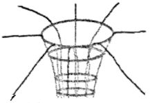

## はじめに

筆者は中三の6月に一旦物理部を辞めている。それで、6月に再入部をしたので、プログラミングは専門外である。しかし個人的に物理学に興味があるので物理学っぽいことを書くことにした。というわけで、少し前に世間を賑わせ、そのままフェードアウトした重力はについてなんとなく分かるくらいに書く。

## 重力とは何者か ―17世紀イギリス―

### 概要

最初から答えを言うが、重力とは、地球が私たちを引き付けたり、太陽が地球を周回運動させたりするあの力である。皆さんは古典力学の祖であるアイザック・ニュートン(1642-1727) があのリンゴのエピソードで万有引力に思い至ったことをご存じだろう。というわけで、第一章ではそれについて関係あるものもそこまでないものも、いろいろざっくりと書く。

### プリンキピア以前

突然プリンキピアという固有名詞が出てきて驚いた人もいるだろう。本当に申し訳ない。プリンキピアというのは後で説明するが要するにニュートンが万有引力について書いた本である。多分科学の本としては世界一有名なので、これだけでも覚えてほしい。

本題に戻ろう。万有引力説以前は、アリストテレスが「どんなものにも本来の場所があり、ほとんどの物体はそれがずっと真下にあり、炎はそれが天上にある。<u>天体は例外で円運動をする</u>」、という説を出したのが近代になるまで信じられていた。

さあ、ここで筆者は妙なデジャヴを感じた。そう、地動説の時と状況が完全に一致する。しかも、やはり近代になってこれを疑う人が出てくるのも一致した。あのガリレオ・ガリレイもその一人だったが、ガリレイは、天体はアリストテレスの言った通りに動くと思ってい たようだ。

その後ニュートンはペストという感染症の流行で大学が閉まったので実家にいたときに* 1リンゴの一件で万有引力にたどり着くのだが、何が凄かったかというと、<u>これは天体にも働く</u>というのだ。同時期のロバート・フックという自然哲学者も同時期の研究から惑星の運動が円運動なのは太陽が惑星を引き付けているからだとし、引力は距離の2乗に反比例する、というところまで求めた。結果的にプリンキピアが出版されることになるが、フックとニュートンはどっちが先だったかで揉めたそうである。

### プリンキピアについて

さあ、プリンキピアという語句がここまでに五回出ているが、どんな本なのかをとりあえず説明しよう。まず、ハレー彗星とかグリニッジ天文台で有名なエドモンド・ハレーは敬虔なキリスト教徒で、アリストテレスの説を覆すのに抵抗があったのだが、*2「もしかしたら惑星の軌道はきれいな円ではなく楕円かもしれない。どう思うか」と訊いたところ、ニュートンは「実は前に計算で求めたことがある。やっぱり楕円だった。途中計算の紙は捨てたが、もう一回別の紙に書いて渡そう」と答えた。これによりハレーはニュートンが自分とは別アプローチで万有引力に気づいていたことを知り、それで本を出すことを提案したことからニュートンが出版したのである。

この本の正式な日本語題は「自然哲学の数学的諸原理」で、書くにしても話の話題にするにしても弊害があるのは自明なので、そのラテン語名である $"Philosophiae\,Naturalis\,Principia\,Mathematica”$の $Principia$(多分正式な日本語題でいう「諸原理」の部分)を抜き出してプリンキピアと呼ばれている。*3物体の運動の法則とか、ここまで触れた万有引力や 天体の運動について触れている。

プリンキピアは3巻に分かれていて、最初の二冊は物体の運動の法則について、まず高校物理で習うように抵抗を無視したうえで考え、次はこれらを勘定に入れて書かれている。そして、三冊目で、万有引力で地上の物理法則から天体の運動まで説明できることが取り上げられている。

微積分が誰のアイデアなのかでほかの学者ともめていたため微積分をしないようにしているが、そのせいで3冊になっているうえ、かなり難解になっている。しかも、第二巻は説明不足になっている。

この説は、万有引力が一瞬で伝わる、ということも表しているが、ほかの重大な発見と同 様に、当初は力が一瞬で伝わるはずがない、とする反対派がかなりいて、ニュートン自身 それに歩み寄るところがあったが、実験で一瞬で伝わると証明されて受け入れられるように なる。
尚、万有引力はこんな式で表される。

$$ F = G\frac{Mm}{r^2}$$

$F$が万有引力の大きさ、$G$は定数、$M$・$m$は二つの物 体の質量で、$r$はその距離だ。二乗なので$r \times r$となる。

## 重力の本質 ―20世紀以降―

かなり間をすっ飛ばしたが、重力は現代物理ではまた違った形で話題になる。ここからが筆者の興味のある分野なのだが、そんなことはどうでもいいのだ。

### 素粒子の場合

素粒子物理学では素粒子は

* 物質を作ったりする素粒子(電子とか、質量があることで一昔くらい前に話題になったニュートリノもこれ)
* 力(<u>重力やら</u>原子崩壊やら光やら)を伝える素粒子

の二種類に大別される。*4重力を伝える素粒子はそのまんま重力子と呼ばれている。が、重カ子自体が観測されていないうえ、質量ゼロ、電荷ゼロとなると観測のしようがないので、ここで素粒子から離れた話になる。

さっきの素粒子の分類における、後者の「力」には、電磁気力・弱い力・強い力・重力の4種類*5がある。

このうち、電磁気力と弱い力は同一視でき、強い力をそこに加える「定説」となった理論はできたものの、重力を入れられる理論だけは未だに確かな理論がない。

とはいえ、この4種類の力は宇宙ができたときには一つだったことが分かっており、重力が最初にそこから分離したようである。

これらをまとめる理論はいくつもあり、素粒子がさらにいくつかの粒子でできているとか、素粒子は小さなひもであるとか、いろいろある。

さらに重力子について言うと、重力だけはなぜかほかの3つよりものすごく弱い。これを 説明するにあたり、ロープが遠目には1次元に見えて近くで見ると3次元に見えるようにこの世界は実は11次元時空であるが、残りの7次元は小さく折りたたまれているとする説が代表的だ。*6これについては、第一章でふれた逆二乗則が、ものすごくミクロなレベルでは破れると最近分かり、かなり確実性が出てきた。他にも、3次元世界はミルフィーユみたいにたくさん平行に並んでいて、重力子だけはそこを行き来できるとか、これには諸説ある。

### 重力場の場合

現代物理では、アルバート・アインシュタインがものすごく有名だが、アインシュタインは重力についても新しい考え方をもたらしている。簡単にどんなものかを説明しよう。

まず、この世界を一様に延々と広がっているゴム膜のようなものと考える。そこに何かものを置くと、その部分が沈む。これが重力だ。そこに十分に軽いものを置けば、沈んだ部分の傾斜で最初に置いたものに引き寄せられるだろう。そう、万有引力が働いたのである。どちらも同じくらいの質量なら、たがいに引かれあう。
また、光はここでは膜上の歪みに影響されながらまっすぐ進むと仮定される。つまり、光でさえも重力で曲がるのである。そして、もしそこにロードローラー*7か何かを置けば、沈むどころかゴム膜がこんな具合に沈む、あるいは破れるだろう。

雑な図ですまないが、このバスケットボールのゴールを 延々と長くした様なのがブラックホールである。周知のとおり一定の範囲に入ると光でさえ出られなくなる。時々それがほかの空間と何かの拍子につながるのだが、それがワームホールだ。

もっと詳しい説明をできればそれが一番だが、残念ながらこれ以上は筆者にとっても皆さんにとっても苦痛になるので、この程度で説明はおしまいである。

### 重力波というが何を感知したのか、そして

では、本題に移ろう,奮力波というのは、簡単にいうと滅茶苦茶密度の高い天体が動くときに発生する空間の歪みである。その歪みは光が一定距離を行って戻るのにかかる時間の方向ごとの差で感知される、というプロセスを経る。これを重力波と呼ぶ。まあ、ざっと仕組みを説明すればこんな感じだ。

これを観測するのにどんなメリットがあるのかというと、おもにこんな感じだ。

* 重力波はすべてを素通りするので、観測できない天体を「見る」ことができる
* これによって今まで観測できなかったより初期の宇宙への理解が深まる

また、この観測装置の精度を上げ、あるいは高精度な観測装置を作るのにおいて世界各国が現在競い合っている状態だ。もちろん日本もその一カ国だ。ニュートリノの観測に使われたカミオカンデの跡始に現在KAGRA(大型低温重力波望遠鏡)が建設中だ。筆者はこの競争による観測用の範囲を超えた技術の向上、そして観測による新たな知識の獲得に期待する。

## 脚注

*1 教師としてではなく、学生としてである。教師が才能に気づいていて、繁師はニュートン に実験室を使わせていた。

*2 地動説の話を知っていれば大体わかると思うので、細かいことは省略。

*3「なぜそこでラテン語!?」、と思う人に説明すると、この時代には、論文はラテン語というのが鉄則だったし、生物学ではそれがとりわけ顕著である。

*4 ヒッグス粒子は一応力のほうに入るようだ。

*5 それぞれ説明すると、常に気力はつまり電力と磁力で、光子により伝えられる、実は日常における物体の衝突もここに含まれる。弱い力は原子崩壊に関わる。太陽がまぶしい理由もこれだったりする。 強い力は、原子核の陽子や中性子の中の素粒子同士を結び付けていて、核力とも呼ばれている。日本初ノーベル賞の湯川秀樹の理論もここに関わってくる。重力についてはわざわざ語る意味が思い浮かばない。

*6 残り一次元は時間だ。n次元は時間と空間だが、7次元は空間だけを指して言っている。

*7 グランドピアノも可。

## あとがき

冗長なうえたいして面白くない文章だったと思うが、これを読んで物理学にほんの少しでも興味が湧いた人がいれば幸いだ。

関係ない話だが、このレポートを打つ前までAキーがあまり反応せず、こんな具合にア段音をコピペしようとしていたが、編集中にAが普通に出るようになった。できればでいいからレポートを作れと筆者に頼んだ高二の先輩にこの場を借りて感謝する。

## 参考資料

* [http:/www.gizmodo.jp/2016/06/2_145.html](http:/www.gizmodo.jp/2016/06/2_145.html)
* [http://gwcenter.icrr.u-tokyo.ac.jp/plan/aboutu-gw](http://gwcenter.icrr.u-tokyo.ac.jp/plan/aboutu-gw)
* [https://ja.wikipedia.org/wiki/超弦理論](https://ja.wikipedia.org/wiki/超弦理論)
* [https://ja.wikipedia.org/wiki/万有引力](https://ja.wikipedia.org/wiki/万有引力)
* [https://ja.wikipedia.org/wiki/ロバート・フック](https://ja.wikipedia.org/wiki/ロバート・フック)
* [https://ja.wikipedia.org/wiki/自然哲学の数学的諸原理](https://ja.wikipedia.org/wiki/自然哲学の数学的諸原理)
* [https://ja.wikipedia.org/wiki/アイザック・ニュートン](https://ja.wikipedia.org/wiki/アイザック・ニュートン)
* [https://ja.wikipedia.org/wiki/エドモンド・ハレー](https://ja.wikipedia.org/wiki/エドモンド・ハレー)
* [https://ja.wikipedia.org/wiki/LIGO](https://ja.wikipedia.org/wiki/LIGO)
* [https://ja.wikipedia.org/wiki/重力子](https://ja.wikipedia.org/wiki/重力子) 2017/06/18 アクセス
* [https://www.s.u-tokyo.ac.jp/ja/story/newsletter/keywords/11/04.html](https://www.s.u-tokyo.ac.jp/ja/story/newsletter/keywords/11/04.html) 2017/07/08 アクセス
* [https://ja.wikipedia.org/wiki/ラテン語](https://ja.wikipedia.org/wiki/ラテン語) 2017/07/13 アクセス
