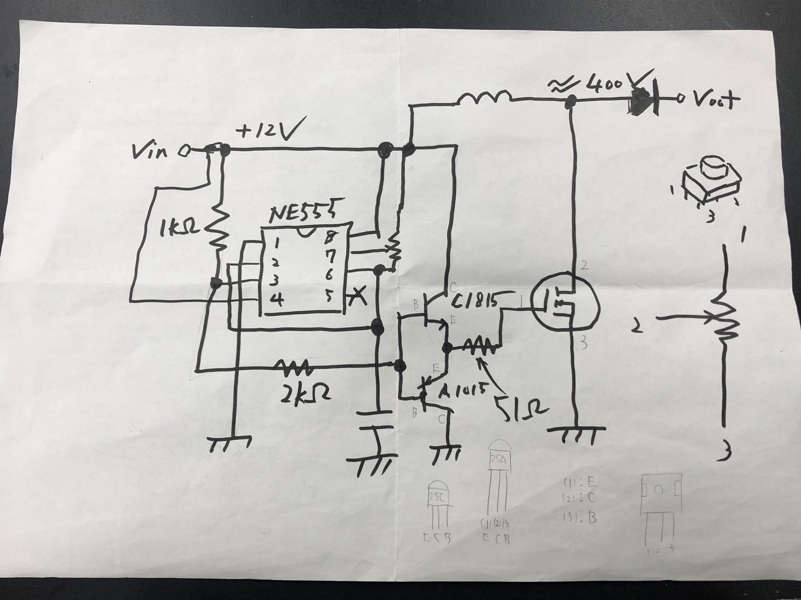
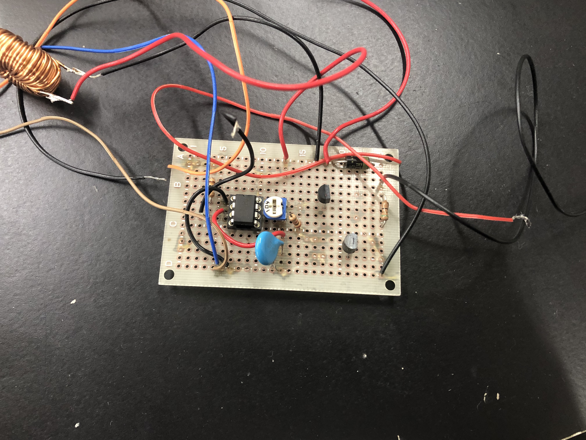
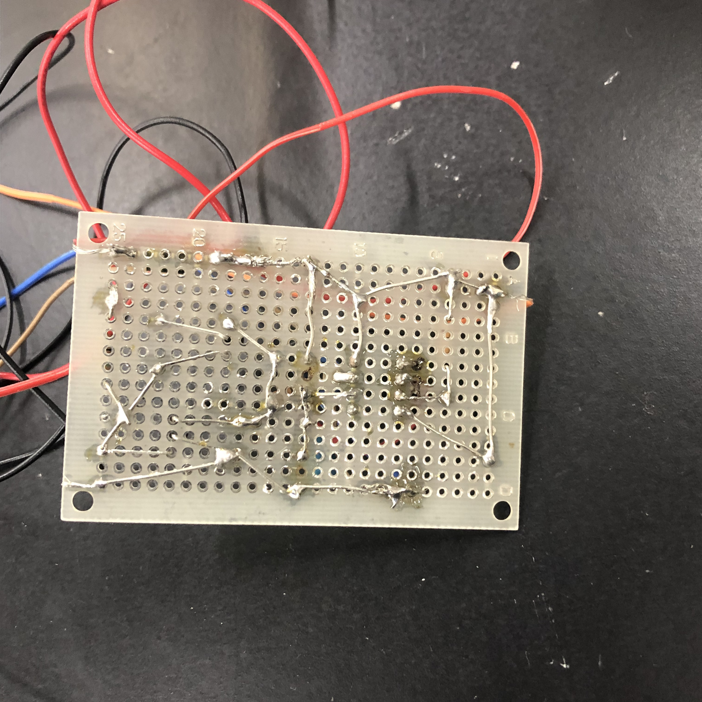
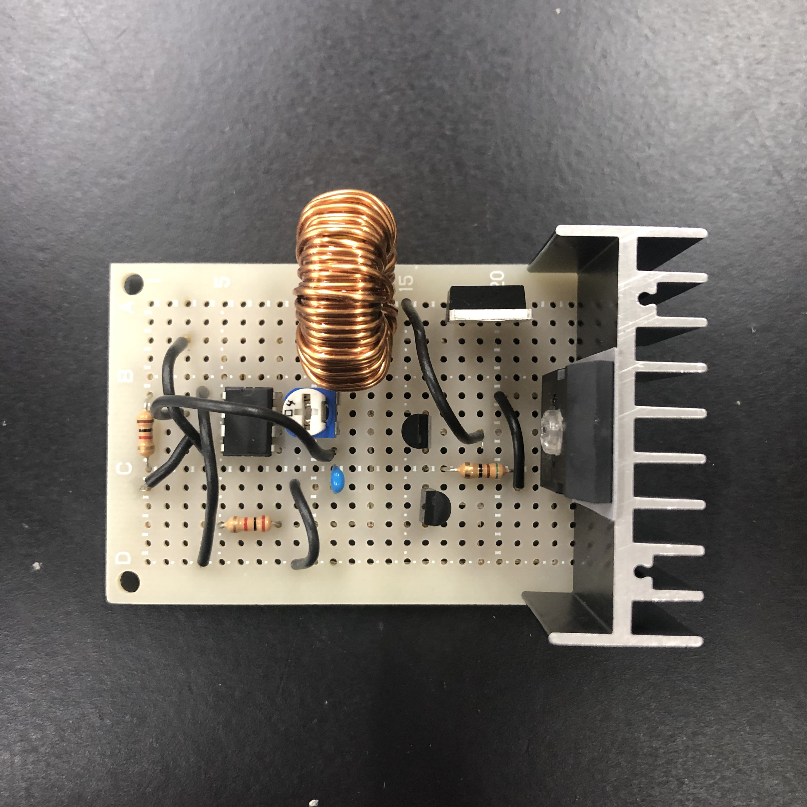
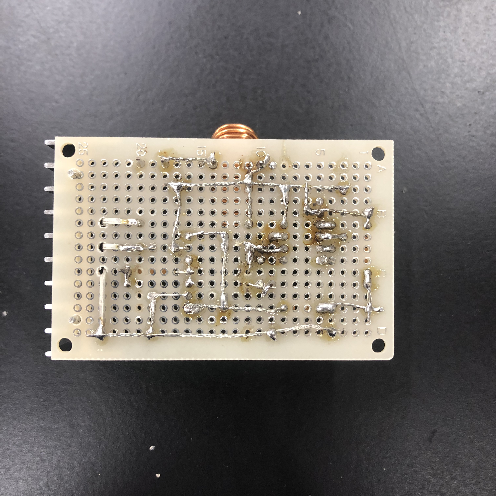
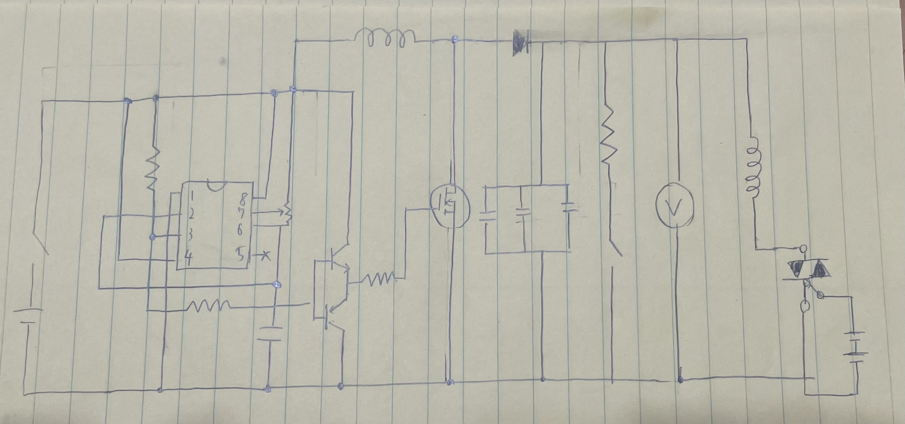

## 初めに

初めまして、高二の電工班長のM.Yです。今回の部誌では、今年製作し、展示しようと思っている、コイルガンの製作過程についてちょっと解説を加えながら語っていこうと思います。
(ガッツリ解説については去年のものとほぼ同じになると思うので)

## コイルガンとは

コイルガンは、超強い電磁石のコイルを用いて金属製の弾を発射するものです。コイルの巻く数やコイルの動力となる電圧の違いによって色々弾の速度が変わっていきます。勿論電圧を大きくしたり、コイルの巻数を増やしたりすれば、弾の発射速度も上昇していきます。

## 製作過程

### 1.昇圧チョッパ・充電回路

昇圧チョッパとは、コイルガン製作において最も肝になる部分です。使いやすいコイルガンの製作にはここの改良が必須です。
今回製作する昇圧チョッパの回路図はこのような感じ。

実は去年、コイルガンを展示するためこの昇圧チョッパの製作をしていました。
**が**、遅々として進まず、去年の文化祭前に出来たものがこれ

なんだこれ…
正直今見ても愕然とするレベルの汚い配線です。
裏側はこんな感じ。~~本当に汚い~~

とまぁ去年はこんな感じで見栄えも悪く、さらにこんなに導線がギャンギャン伸びててどこかでショートしそうで怖いので新しい物を作ろうとしました。
**が**、技術不足等で遅々として進まず。
電工班長のくせして電工の知識がほとんど皆無なのです(**電工班長のくせに**)。前部長に聞きながらかなり日数を要しましたがなんとか完成にこぎつけました。

{height=200}

まぁ去年よりはマシ…かな？
裏側はこんな感じ

{height=200}

そこからせっせとコンデンサの充電回路の製作に励んでいました
**が**、またしても問題発生。
導線の直径の定格電圧を完全無視してました。今回400Vの電圧を流す予定なのですが、案の定、定格電圧をオーバー。(定格電圧とは、定格として定められてる上限の電圧です。導線の太さによって変わってきます。これを超えると安全の保証がなくなります。多分大抵の場合焼き切れます。)急いで付け替えてなんとか完成。

### 2.電源

コンデンサの充電に絶対必要な部分です。これが無いと回路を全部作ったとしても一生動きません。今回昇圧チョッパに使用するNE555という部品の耐圧が16Vが限界なので、15V前後のものを電源に使おうと思います。

### 3.安全回路

コンデンサに充電したけど射撃回路が動かなくてコンデンサから放電したい…。そんな時1番手っ取り早いのはショートさせることですが、何せ高電圧の電流です。ショートさせれば閃光と大きな音が出ます。(この大きな音に驚いた後輩の悲鳴が部内ではミームになってたり…)また、やり方が悪いと感電する可能性があります。いちいちショートさせるのは怖いので、メタルクラッド抵抗という抵抗を回路上に入れ、ダイオードから放電する際、安全に放電できるようにしました。
メタルクラッド抵抗とは、熱の拡散がしやすい、環境変化に優れた機器です。

### 4.電圧計

回路に流している電圧が分からないと最悪充電対象のコンデンサが爆発するかもしれないので電圧計が必要です。しかし、今回使う電圧は400V。500Vの電圧計が必要になります。500Vの電圧計は9/13現在、Amazonで¥1,620。少し高いです。ということで、50Vの電圧計の中に入っている抵抗の値を10倍にして500Vの電圧計にします。元々中に入っている抵抗は51kΩなので510kΩに取り替えれば良いわけですね。

### 5.スイッチ

コイルの電源のONとOFFを切り替える重要な部分です。今回はトライアックを使用します。
部誌を書いている現在(9/13)未だに製作に至っていません。~~はよしろ~~

### 6.コイルと弾

これが無いとコイルガンじゃありません。
コイルは倉庫にあったものから、弾は部品箱に入っていたものを使っています。コイルは改良するかもしれません。

## まとめ

ここまで書いたことを全部回路図にするとこうなります。  

昇圧チョッパ以外右側のトライアックの部分を除けば結構スッキリしてますね。
(抵抗の値など細かい部分は省いています。)

## 終わりに

いかがでしたでしょうか。
今年コイルガンを作ってみた感想ですが
まずめっちゃ大変でした。ド素人の技術からどうにかしてデータシートを読めるようにし、あまりなれていないユニバーサル基盤に部品をはんだ付けをし…という作業にとにかく時間がかかる。本当はもっと改良を加えたい点も沢山ありましたが、時間に追われ、出来ず終いです。反省点も多々あります。基盤をもうちょっと大きくすればよかった等…(書いていくとキリがない)。しかし、大変でしたが、とてもやりがいがある、というか楽しいものでした。
また今度、コイルガンを作る機会があれば、もっと電工について学び、筐体をつくったり、指定の電圧で充電が停止できるような回路を作ったりしたいものです。(Re:ゼロから始めるコイルガン製作)
最後に、ここまで技術を提供して頂いた前部長、部誌の校閲・発行等をして頂いた顧問の先生方、編集担当の方々、このPositronを読んでいる皆様に感謝申し上げます。
それでは皆様、物理部展#2022をお楽しみください。

