## はじめに

こんにちは。去年の部誌も読んでくださった方は1年ぶりです。高校一年生のK.R(去年の部誌ではR.Kとして紹介)です。  
この記事を書き始めたときにはもう文化祭まで2週間を切っており、急いで執筆することを強いられています。そのうえ、まだ僕は物理部で製作途中の作品がありそれも完成からは程遠く、残り2つの兼部先でも多くの作業を抱えており、本当にこの記事を書き終わって作品を作り終わり他の部活のタスクも終わらせることができるかが心配です。もし僕が文化祭の日に死体が如く部室に横たわっていたら、作品が完成しなくて落ち込んでいるか数々の作業で疲労しているかのどちらかが理由であると思います。部員の皆さん、僕の死体を発見した時にはジュースでも奢って下さい。  
字数稼ぎができました。では、本題に入りましょう。  
この記事では、僕が電子工作班の作品制作でよく使用している、LEDについて自分なりに解説します。    
 僕はPC班員として物理部に入部し、中2までは気まぐれでプログラミングをしていましたが、中2の後半になって電子工作に興味を持ち始め、中3の後半になってようやく本格的に電子工作を始めました。遅咲きですね。  
そのときに先輩が途中まで制作した、LEDを使った作品を引き継ぐことになり、自分でどうやって動かすかを調べて最後まで配線しました。入部してからPC班である程度構築されていたプログラミングのスキルを利用して、そのLEDをプログラミングで制御することもできました。  
それをきっかけに主にLEDを使った作品制作を本格的に始めるようになりました。  
ということでこの記事では、僕がLEDの作品を1年作り続け、暇があれば電子部品のサイトを徘徊していたその経験に基づいて、LEDの種類とその制作例、作品の大まかな仕組みを説明します。  
タイトルの「知れば知るほど知りたくなる」というのは1分でなんとなく思いついたタイトルですし、本当に知りたくなるほど奥深い世界を描写できているかは分かりません。それでもこの記事をきっかけに少しでもLEDに興味を持ってくれる人がいることを願っています。  
拙い文章ではありますが、どうぞお楽しみ下さい。  
  
## そもそもLEDとは

まずはLEDの基本的な内容・特徴について説明します。LEDとは**発光ダイオード**(**L**ight-**E**mitting **D**iode)の略で、ダイオードの一種です。  
ダイオードとは、**アノード**から**カソード**の1方向にしか電気を流さない(**整流作用**をもつ)電子部品です[^1]。その性質を生かし、逆流を防止するために回路に挟まれたり、ACアダプターなどで平滑回路とともに交流を直流に変換する回路の一部(整流回路)に使われたりしています。  
下の図は、ダイオードの回路図記号です。  
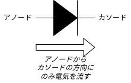

LEDとは、そのダイオードの中でも電気を流して発光するものを表しています。下の図はLEDの回路図記号です。  
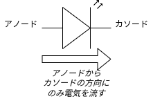

また、LEDの中で最も一般的なものは、下の写真のような「砲弾型LED」とよばれるものです。  
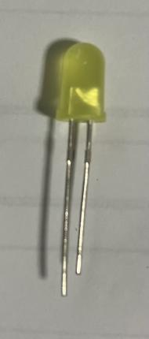{height=300}

砲弾型LEDは、発光する素子をプラスチックで覆うことで素子を保護し、素子からの光を拡散しています。  
LED単体での光の色は、LEDが発する光の電磁波の波長によって決まります。例えば、紫色の波長は380nm〜450nm、青色が450〜485nm、緑色は500〜565nm、赤色は625〜780nmです。波長が紫色から赤色の範囲までの光はヒトの目で見ることができ、その範囲の光線を**可視光線**といいます。赤色よりも波長が長い光は**赤外線**とよばれています[^2]。  
砲弾型LEDにも白色で光るものはありますし、恐らく殆どの家庭に白色のLED電球や白色のLED蛍光灯はあると思いますが、可視光線の中に白色はありません。今の技術で**白色の電磁波を作ることは不可能**なのです。
しかし、複数の色を合わせることで、白色などの可視光線では表現できない光の色を作ることが可能になります。読者の多くが「光の三原色」という言葉を聞いたことがあると思います。「光の三原色」の考え方に沿った場合、**赤色、緑色、青色**の3色のLEDを組み合わせ、それぞれの明るさを調節することで色が混ざって様々な色をつくることができます。例えば、すべてのLEDを点灯すると白色に見え、赤色のLEDと青色のLEDだけを点灯すると紫色に見えます。色のこのような表現法のことを、それぞれの頭文字をとって「**RGB**」といいます。「R」、「G」、「B」は色の三原色のそれぞれの色を英語にした頭文字(**R**ed、**G**reen、**B**lue)をとっています。  
[^3]

ここまである程度LEDの基本について説明しました。  
もっと詳しいことは第3章以降で説明しますが、LEDは部屋などの照明に使われているのは勿論、人々に情報を提供することも、部屋の雰囲気を変えることも、娯楽として利用することもできるのです。このように、LEDは人間の生活においてとても身近であり、大切な役割を果たしているのです。  

## マイコンとLED

ここからはLEDの形態や作品例を説明したいと思うのですが、その前に、LEDを扱ううえで大切な「**マイコン**」について説明します。「マイコン」とは「**マイ**クロ**コン**トローラー」の略で、プログラムを書きこむことで電気の複雑な入力(スイッチやセンサーなどの読み取りなど)や出力(モーターの回転やLEDの点灯など)ができる集積回路です。  
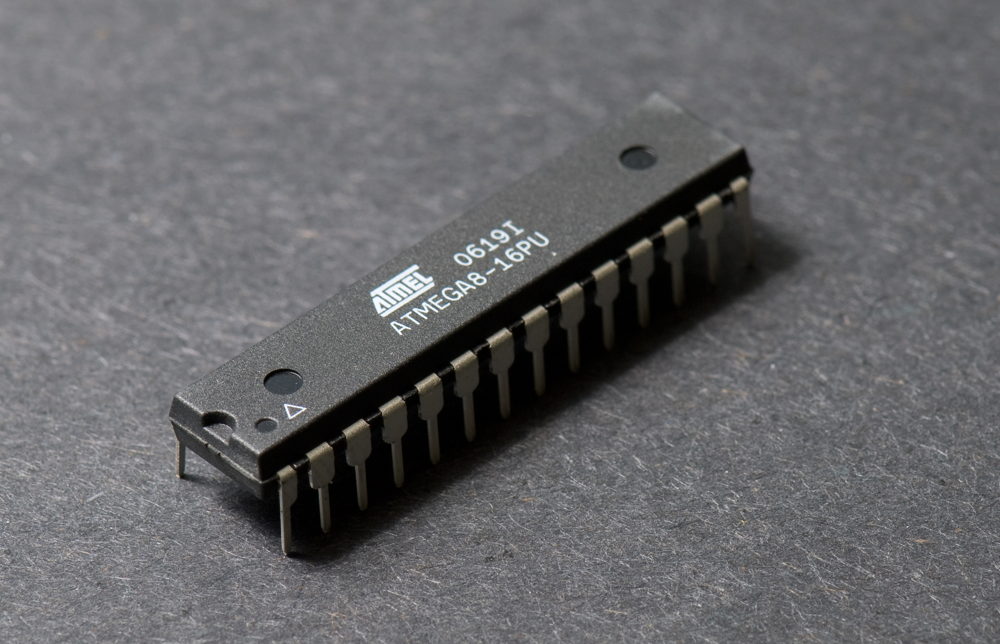{height=250}
[^4]  
マイコンを単体で扱うこともできますが、マイコンをさらに扱いやすくした基板である**マイコンボード**というものもあります。マイコンボードの代表としては、2005年にイタリアで開発された**Arduino**(アルドゥイーノ)が挙げられます。下の図は、Arduinoの主要モデルであるArduino UNOの写真です。  
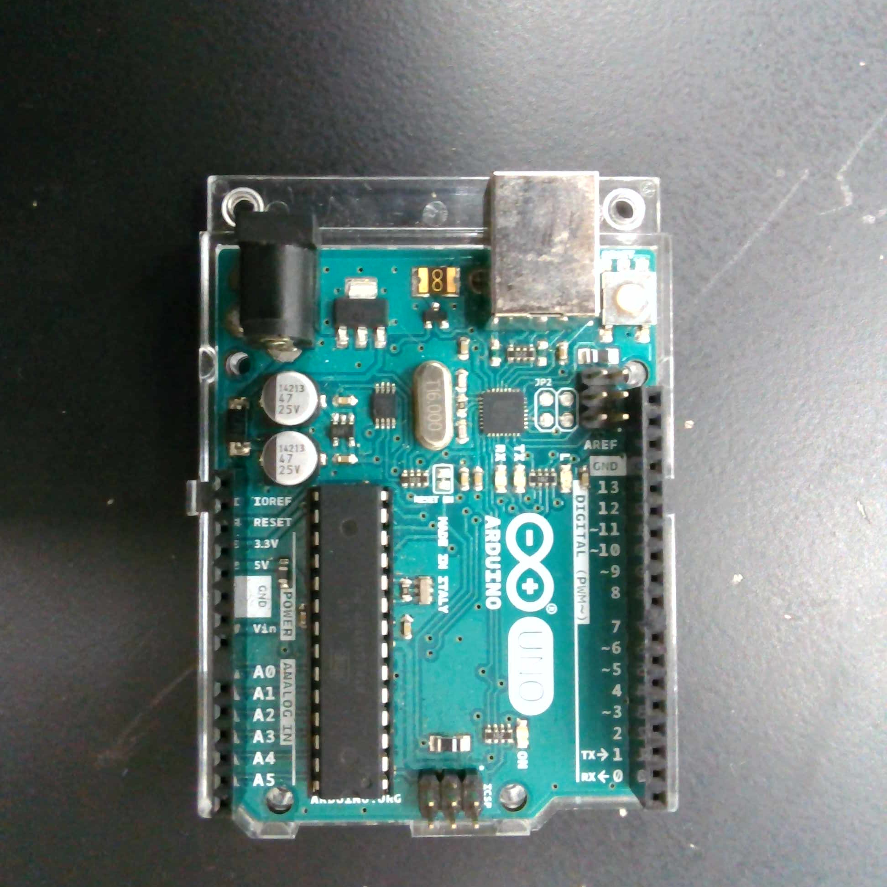{height=280}

Arduinoとは、ピンに導線を挿してセンサーやトランジスタ、LEDやモータードライバーやモーターなどの電子部品を配線して回路をつくり、**Arduino IDE**という専用のアプリケーションを使用して、C++をもとにしたプログラミング言語でプログラムを記述し、**コンパイル**して作った**スケッチ**を書き込むことでプロジェクトが完成します。  
{height=300}

下の図は、Arduinoをプログラミングする流れを大まかに描いた図です。  
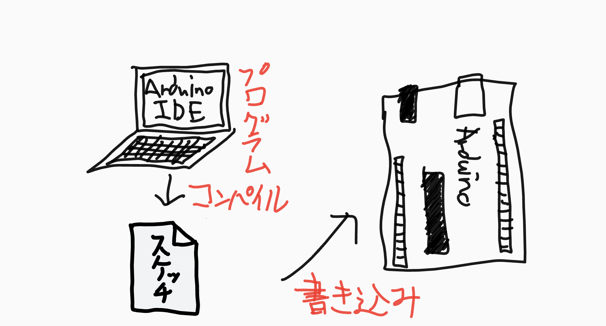{height=300}

ライブラリも充実しており、後述するたくさんの種類のLEDをすべて制御することができます。  
ここまで難しい言葉を羅列してきましたが、やっていることは「**配線してプログラムを書き込む**」という、たったこれだけなのです。Arduinoは、初心者には本来難しいはずの**マイコンの制御を初心者にも簡単にできるようにした**、革新的なアイテムなのです。  

## LEDの種類

ここからは、LEDを光らせる形態としてどのようなものがあるのかを説明していきます。勿論この世にはたくさんの形態があり、部誌の中にすべてを収めるのは難しいです。個人の2年間の電子工作の経験をもとに、「これはよく使われる」と思ったLEDを4個選びました。  

### Ⅰ.砲弾型LED

第1章でも少し書きましたが、最も一般的な種類のLEDです。発光する素子にプラスチックのカバーがついているだけですが、その中にも更に細かい種類があります。
まずは、下の図を御覧ください。  
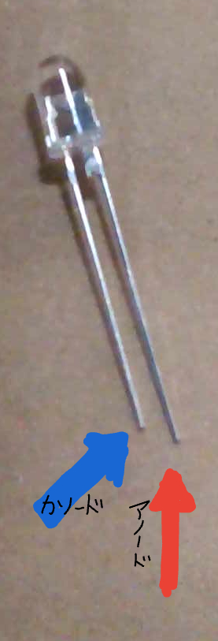{height=300}

LEDには端子が2つあり、長い方を「**アノード**」、短い方を「**カソード**」といいます。例えば電圧が5Vの電源装置を用いた場合、およそ200Ωの抵抗を回路の中に入れることで明るく点灯します。  
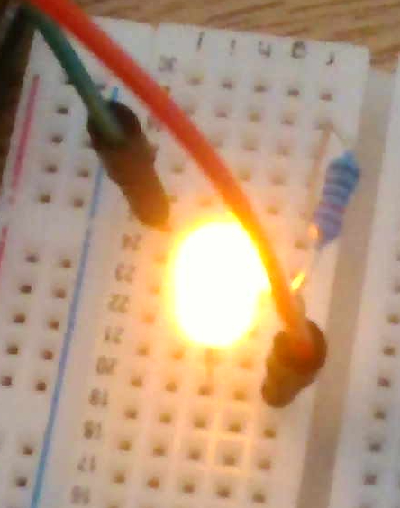{height=300}

しかし、このようなLEDは単色にしか光りません。「場面によって光る色を変えたい」「LEDの色を滑らかに変えたい」などと思ったら、下の図のようなLEDを用いるとよいでしょう。  
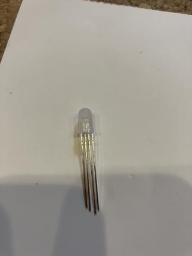{height=300}

このLEDは、中に光の三原色である赤色、緑色、青色のLEDが入っていて、それぞれのLEDの光の量を調整することで、様々な色の光を作ることができます。このようなLEDを「**RGB LED**」とよびます。  
このLEDは端子が2個ではなく4個になっています。なぜそうなっているのでしょうか。  
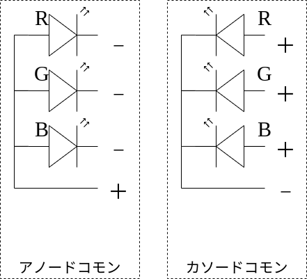{height=300}

そもそも端子が4つのRGB LEDには主に「**アノードコモン**」「**カソードコモン**」の2つの種類があります。  
まず、アノードコモンのRGB LEDには1つの+端子、3つの-端子があります。+端子に電源の+極をつなげ、3つの-極に流れる電流の大きさをそれぞれ制御することで、3つの光の量を調整することができます。
一方、カソードコモンのRGB LEDは、3つの+端子、1つの-端子があります。-端子を電源装置の-極に繋げ、残りの3つの+端子の電流の大きさを制御することで様々な色に発光させることができます。  
Arduino等のマイコンボードには、ピンがそのまま+極となるためアノードコモンのRGB LEDよりもカソードコモンのRGB LEDのほうがよく使われます。 
その他、「素子の中に抵抗器を内蔵しているLED」「アノードからカソードに電気を流すだけで色がゆっくり変化するLED」「キャンドルのように明るさが変わるLED」「リモコンなどに使われる赤外線LED」など、砲弾型LEDにも様々な種類があります。  
このように、LEDの中では一般的な砲弾型LEDであっても、作りたいものに合わせてその種類も豊富なのです。  

### Ⅱ.チップLED

次に説明するのは「**チップLED**」です。チップLEDとは、プリント基板上などに**表面実装**する(穴に導線を挿してはんだ付けをするのではなく基板の表面にはんだ付けをすること)ためのLEDです。「表面実装用LED」ともよばれたりします。  
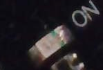{width=200}
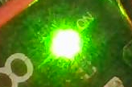{width=200}

そのサイズは、多くの砲弾型LEDの樹脂部分の直径は5mmであるのに対し、上の画像のLEDの場合、長辺が1.6mm、短辺が0.8mmと、素手で扱うことがとても難しいくらいに小さいです。  
この小さなLEDですが、その小ささを生かして身近な様々な製品に利用されています。  
例えば、部屋の天井にあるLEDの電灯は、1つの電灯で1つのLEDの素子が使われていると思われがちですが、そうではなく実はたくさんのチップLEDを並べて点灯させることで部屋を照らすという仕組みの製品がほとんどなのです。  
また、この後説明するLEDマトリクスパネルやLEDテープのLEDの1つ1つもチップLEDです。RGBのチップLEDが使われていることもあります。  
さらに、多くの電気製品に搭載されていて、電源が入ると点灯したり色が変わったりする、電源ランプにも多くはチップLEDが使われています。  
その他にも説明しきれないくらいにチップLEDには様々な使われ方があります。そのくらいチップLEDとは普段の生活に身近であり、日常生活に欠かせないものなのです。      

### Ⅲ.LEDマトリクスパネル

次に説明するのは、たくさんのチップLEDを一面に並べることで、それぞれのLEDの点灯/消灯で文字や絵を描画することができる、「LEDマトリクスパネル」です。  
ArduinoなどのマイコンボードやRaspberry Piなどのシングルボードコンピューターなどを使用してプログラムによって制御したり、専用のコントローラーを使用したりすることで自由自在に制御することができます。  
下の写真は、Arduinoを使用してLEDマトリクスパネルに文字をや絵を表示させてサインボードを作っている例です。  
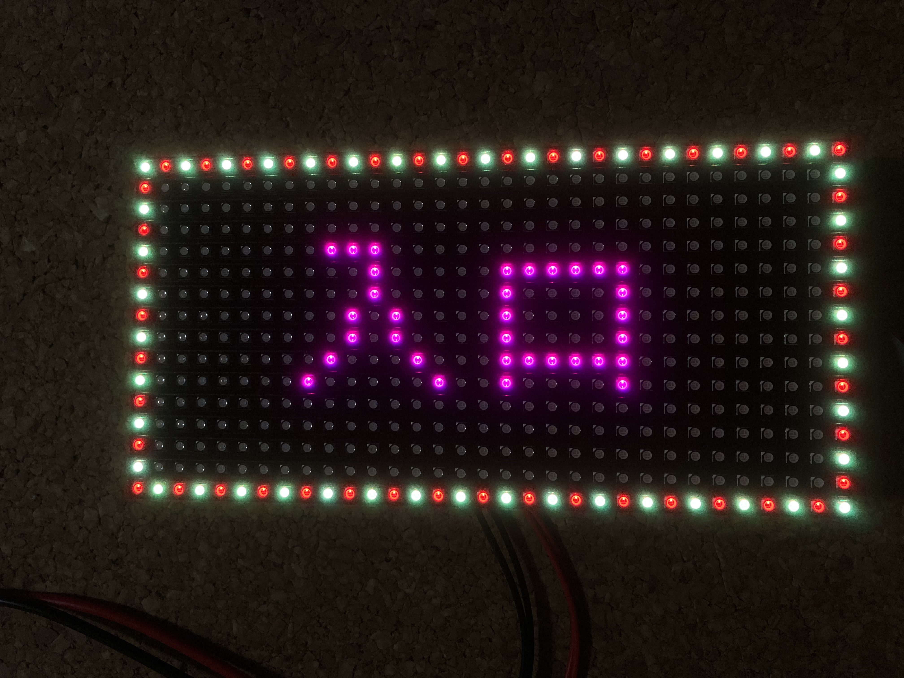
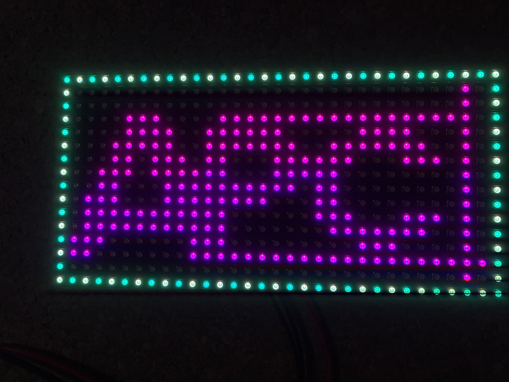

おそらく多くの人がこのようなパネルが店などに使われているのを一度は目にしたことがあると思います。また、鉄道の発車標などの電光掲示板にもLEDマトリクスパネルが使われています。  
{height=300}

掲示板の形態が多様になりつつある現代においてもLEDマトリクスパネルは大切な役割を果たしています。  
たくさんLEDがあることを利用して、他にも様々な作品に応用することが可能です。その応用例は第4章で紹介します。  
制御しやすいLEDマトリクスパネルで有名なものには、アメリカのAdafruit Industriesが製造する**RGB Matrix Panel**があります。このLEDマトリクスパネルは、Adafruitが提供するライブラリを使用して、簡単にArduinoやRaspberry Piでマトリクスパネルを制御することができます。ちなみにRGB Matrix Panelの使い方についてはこのページが参考になります。  
[32x16 and 32x32 RGB LED Matrix](https://learn.adafruit.com/32x16-32x32-rgb-led-matrix)    

### Ⅳ.LEDテープ

僕がこの記事を書いたのはLEDテープについて熱く語りたかったからと言っても過言ではありません。LEDテープは、僕が最も重要だと考えるLEDの形態です。  
LEDテープとは、チップLEDを並列回路で配線し、帯状にして壁や天井などに貼り付けたりすることができるようにしたものです。市販のLEDテープは1mか5mの長さで、下の写真のように専用の樹脂でロール状に巻かれて売られているものが多いです。また、はさみやニッパーなどを使ってLEDテープを途中で切断することができるので、使いたい長さでテープLEDを使うことができます。  
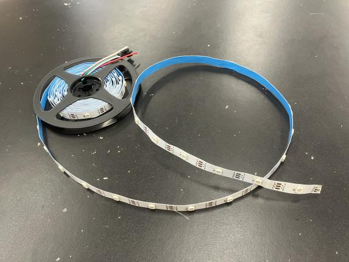{height=300}

LEDテープにも多くの種類があります。  
まず、導線に繋がっている端子が2つあり、それぞれが+極(VCC)と-極(GND)で、その導線に電源装置をつなげることで特定の色に発光するというものです。発光する色は白色や橙色などの電球色に近い色が多く、部屋の照明などに使われることが多いです。下の写真はその一例です。 

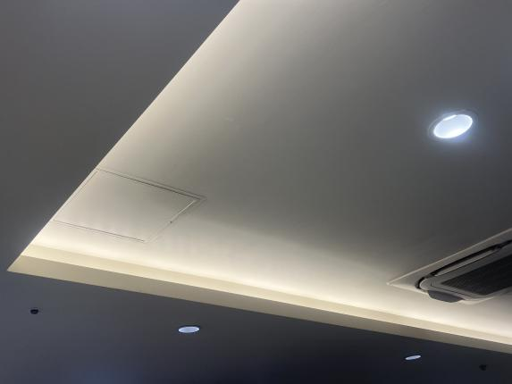{height=300}

また、端子が4つのLEDテープで、赤色、緑色、青色の明るさを調整することで様々な色をつくることができるものもあります。4つの端子のうち3つがそれぞれ赤色、緑色、青色のLEDに繋がっている+極で、残りの1つが-極(GND)です。3つの+極に流す電流の大きさを変えることで色を調節することができます。考え方はカソードコモンのRGB LEDと似ています。先程書いた単色のLEDは電源装置に直接接続するだけで光りますが、このLEDは**専用のコントローラー**を用いて3原色の光の量を調整して光らせることが多いです。コントローラーによっては色をスムーズに変えて鮮やかな光の演出を作り出すことができるものもあります。使い道は先程の単色LEDと同じ部屋の装飾ですが、このLEDテープの存在によってただ部屋を照らすのではなく、鮮やかに照らすことができます。  
他にも色々ありますが、最後に紹介したいのは一番応用が効くテープLEDである、**NeoPixel**のLEDテープです。NeoPixelは先程登場したAdafruit Industriesの登録商標で、主にWS2812BというチップLEDを並列に配線しています。他のLEDテープとの決定的な違いは、ArduinoなどのマイコンボードやRaspberry Pi、専用のコントローラーを用いて**個々のLEDのRGBの光量を指定することができる**ということです。例えば、1番目のLEDは赤色に点灯して2番目のLEDは白色に点滅させて3番めのLEDはゆっくり赤色から青色に色を変えて4番目のLEDは黄色で点灯している状態からだんだん暗くして消灯させる…などの複雑なことができるのです。  
NeoPixelのLEDテープは端子が3つあり、1つは+極(VCC)、1つは-極(GND)、そして残りの1つはDINといって、マイコンからDINに電気を流すことで個々のLEDの色・明るさを指定することができます。
NeoPixelの個々のLEDを指定できるという長所を生かし、マイコンと組み合わせてNeoPixelを使用した作品もたくさん存在していて、物理部展でも展示されています。詳しくは第4章で解説します。詳しいNeoPixelの使い方は、Adafruitによるこちらのページが参考になります。  
[Adafruit NeoPixel Überguide](https://learn.adafruit.com/adafruit-neopixel-uberguide)  
LEDテープの使い道は屋内の部屋の装飾、マイコンと組み合わせた作品製作しか説明しませんでしたが、LEDテープの中には表面をエポキシ樹脂で覆ったりシリコンのカバーでLEDテープ全体を覆ったりすることで防水・防塵性能を上げ、屋外でも点灯することができるものもあります。  
LEDテープの主な役割は「派手に装飾すること」ですが、その方法にも色々あり、奥が深いのです。もし更に興味を持ったら更にLEDテープについて調べてみたり、身の周りに使われているLEDテープを見つけてみてください。    

## 作品例

ここからは物理部で作られたLEDの作品の概要、大まかな仕組みを説明します。

### 5x5x5 LEDキューブ

{height=300}

この作品は、2019年のときに僕より2学年上の先輩が制作し、2022年までに3年間代々展示されている、「物理部展といえばこれ!」という作品です。  
縦に5つ分、横に5つ分、上に5つ分、合計125個の赤い砲弾型LEDをキューブ状に配線しています。Arduinoの中でも特にピン数が多い、Arduino Megaを使用して、125個のLEDの点灯/消灯を1つ1つ制御しています。雨が降っているようなアニメーション、LEDをランダムに点灯させているアニメーション、数字を表示させるアニメーションなどさまざまなアニメーションでLEDを光らせることができます。  
砲弾型LEDは、決して使い道がものすごく多い電子部品であると言うことはできませんが、LEDキューブは砲弾型LEDの応用方法としては有名なのです。  

### (未完成)アーケードゲーム

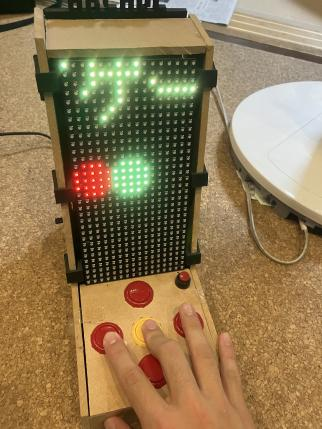{height=300}

この作品は、去年の文化祭前に先輩が途中まで筐体を作って、文化祭後に僕が筐体を最後まで組み立てて電子部品を配線し、途中までプログラムした作品です。僕がLEDに興味をもったきっかけの1つでもあります。  
先程紹介した、Adafruit IndustriesのLEDマトリクスパネルであるRGB Matrix Panelを、Arduinoを使用して画面に文字や絵を表示させています。ゲームスイッチを使って操作できるようにし、スピーカーを使って音を鳴らすこともできます。LEDマトリクスパネル専用のコントローラーだと1つのパターンの絵を表示させることしかできませんが、ArduinoはLEDの操作のみならず、ボタンの読み取り、音を鳴らすことなど様々なことができるほか、複雑なプログラムを組むことができることを利用して、ゲームを作ることもできます。様々な電子部品を操作・制御できるというArduinoの長所を生かしつつ、LEDマトリクスパネルの魅力を利用することで、より輝かせることができた作品です。しかし、アーケードゲームのプログラムを完成させる前に他の作品に手をつけ始めたので、この作品は2022年度の文化祭では未完成の状態で展示します。来年の文化祭をお楽しみに。  

### 7セグメントLED時計(小・大)

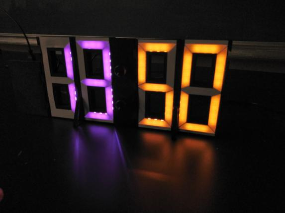{width=300}
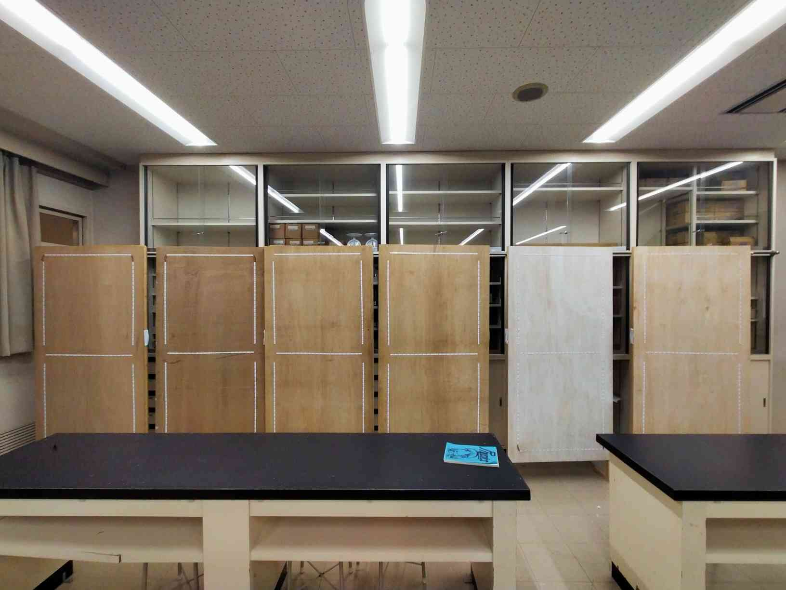{width=300}

この作品は、僕がこの1年間で作った中でも特に自慢の作品で、2022年度の物理部展の目玉とも言える作品です。(僕がアーケードゲームの製作を途中で諦めたのもこの作品に取りかかり始めたせいです)  
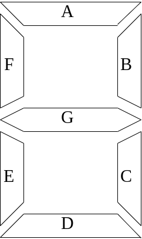{height=300}

「**7セグメント**」とは、上の図の、`A`〜`G`の7つのセグメントを、LEDをセグメントに内蔵して1つ1つのセグメントを点灯/消灯させることで、0〜9までの数字や一部のアルファベットを表示させる技術です。例えば、上の図の`B`・`C`・`F`・`G`を点灯すると数字の「4」、`A`・`D`・`E`・`F`・`G`を点灯するとアルファベットの「E」と表示させることができます。恐らく、読者の殆どの方がデジタル時計や家電を操作するリモコンなどに7セグメントの表示が使われているのを見たことがあると思います。  
この作品では7セグメントの技術を利用して、時刻を表示する時計を制作しました。大まかな仕組みとしては、7つのセグメントの1つ1つの光源としてNeoPixelのテープLEDを切ってはんだ付けして配線しました。時刻を表示することができるようにそれを複数作り、Arduinoに繋げました。設定した時刻のデータを出力することができる**RTCモジュール**もArduinoに配線し、Arduinoが現在時刻の情報を得ることができるようにして、そのデータをもとにLEDテープを点灯/消灯して時刻を表示させました。  
とても大きな時計を作ることが最終目標でしたが、まずはとりあえず試作機となるものを作ってみるということで、昨年度の2月頃に小さな時計から作りました。  
A4のコピー用紙に設計図を書いて筐体を一から設計し、家にある3Dプリンターで造形しました。  
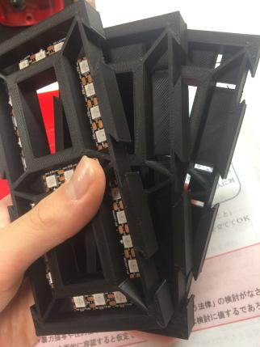{height=300}

カットしたLEDテープをはめてみたところぴったりはまったので、はんだ付けしてLEDテープ同士を繋げました。ちなみにはんだ付けにかかった時間は合わせて24時間以上です。  
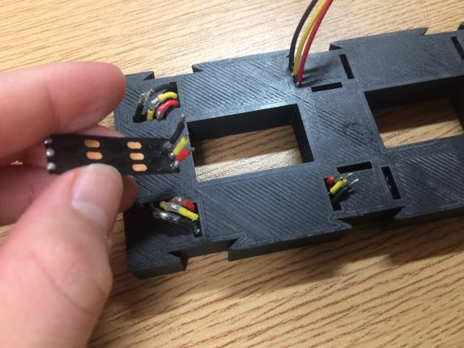{width=200}
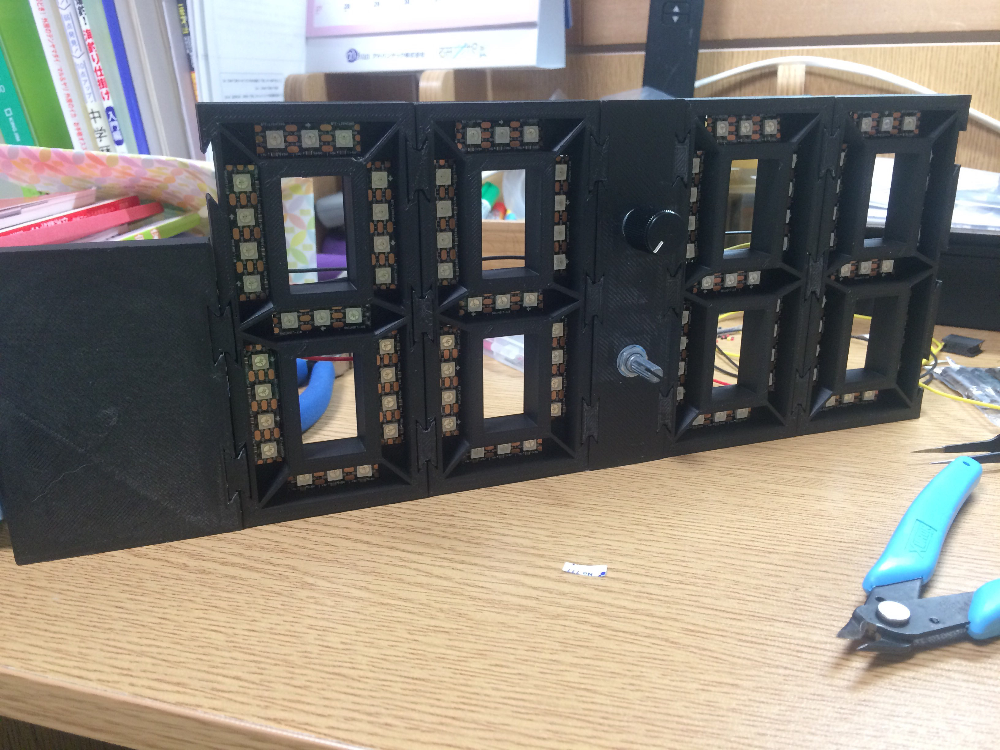{width=200}

4つの7セグのはんだ付けが終わったら、プログラムを組んでArduinoに書き込み、表面に薄いプラ板を貼り付けて完成しました。試作機は無事点灯し、試作機の製作は大成功でした。ちなみに、この時計は特定の色ではなくカラフルに光ることから、一部の後輩からは「ゲーミング時計」と呼ばれています。  
この時計は横幅が約30cm、高さが約13cmです。しかし、今回の物理部展で展示した大きな7セグ時計は横幅 x 高さが91cm x 182cmのベニヤ板に木の枠をつけたパネルを6個横1列に並べました。横幅は約6mで、小さい7セグ時計のおよそ20倍にもなります。  
使用した電子部品の値段もスケールが違います。使用したNeoPixelのLEDテープは長さ30mで、チップLEDの数は900個です。値段にして約11000円でした。また、この沢山のLEDテープには大電流を流す必要があるため、電源モジュールも強力なものを使用しました。秋葉原にある「Akiba LED ピカリ館」という店で[MEAN WELL LRS350-5](https://www.akiba-led.jp/product/1640) を購入しました。値段は7330円でした。その他も色々購入し、正確には計算していませんが総額はおよそ50000円になったと思われます。僕の役職は会計なのですが、わざわざ他の部員を通さずに部費を消費できるので会計になってよかったと思いました。  
また、ターミナルブロック(端子台)やら圧着端子やらモノラルプラグやらイヤホンジャックやら断面積1.25平方ミリメートルの太い導線やら…今まで扱ったことのない配線部品をたくさん扱うことになり、それらを扱った経験はとても貴重なものでした。特に、ArduinoとLEDテープのDINを繋げるために、モノラルプラグとジャックを用いるという方法を思いついた僕は天才だと思いました。下の写真はパネルの裏側です。  
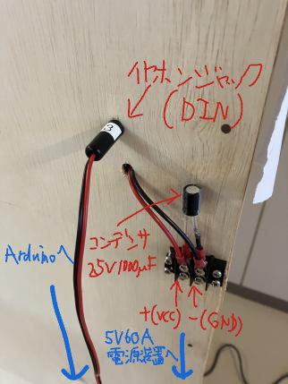{height=250}

設計図は6月ごろから描き始め、夏休みになってLEDテープを貼り付けてはんだ付けしてそれが終わったら筐体づくり…と思ったのですが夏休み中の活動時間が極端に少なく、またその大きさ故にはんだ付けをしている途中で夏が終わってしまいました。そこから文化祭の準備期間である程度巻き返してはんだ付けは何とか全部終わらせられたのですが、Arduinoのプログラムが完成しておらず、この部誌を書き終わっている時点でもまだLEDを光らせることができていません。巨大7セグ時計が完成して展示場所で光っているかはその日になってからのお楽しみです。  

ここまで、LEDを使った作品を説明してきました。ここでは作品を3つしか紹介しませんでしたし、その中には執筆時点では未完成のものもあります。しかし、この作品例を見て、LEDで作品を作ることが少しは楽しそうと思えた人が1人でもいてくれたら嬉しいです。  

## LEDの作品を作ってみて  

ここまでLEDについて色々説明してきましたが、それだけではつまらないし何か物足りないのでLEDの作品を1年間作り続けてきた感想をひたすら述べていきます。  
まず、まさか中1から中2の前半まではPC班員として活動してきた部員である僕が、唐突に電子工作、特にLEDに興味を持ち始めて作品を作るとは自分も含めて誰が思っていたでしょうか。もし誰かが中1中2の自分に「2、3年後の君はLEDの作品をたくさん作っているよ」と話しかけてきたら驚いていたでしょうか。それを想像するのもとても楽しいものです。数年後の自分、数カ月後の自分、いや明日の自分が考えていることさえも未知数なのです。この自分の「好きなもの」の流れの変化から、「明日の自分は未知数だ」という教訓を学ぶことができたと思います。この文化祭が終わって自分が何をやりたいと思うのか、心の中に決めてこそいますがそれを本当に実行するのか、それともまた新しいことを始めるのか…1年後の文化祭で自分が作り出すものを見るのが楽しみです。  
しかし、突然LEDに興味を持ち始めたことは「偶然」ではなくやはり「必然」だったのかもしれません。自分の周りに電工班員がいて、LEDを扱っている先輩がいて、電工班員(特にその先輩)に影響を受けた自分がいて、勇気を出して引退する先輩が製作途中だった作品であるアーケードゲームの製作を引き継ぐことを誓った自分がいて…そのことが僕にLEDの作品を作る勇気と希望を与えてくれたのかもしれません。しかも、それだけではありません。僕の承認欲求がある程度高かったこと故、先輩に褒められたい、部員に注目してもらいたい、物理部展を更に盛り上げることに貢献したい…などと思いながら作品を作り、作品制作の進捗を部活のチャットで報告するたびに部員から応援や称賛の言葉をもらって、作品が完成すれば先輩を中心とした部員から、チャット上や口頭で祝福の言葉を沢山いただきます。自分で作品を作っているだけでも十分楽しいのですが、部員の存在があってこそ今の自分があるのだと思います。部員には、僕が色々くどいのにも関わらず(数名冷たい方はいますが)何かしらの形で応援してくれていることに感謝しかありません。部員への感謝というものは、物理部に何かしらの形で大きな貢献をすることによって初めて感情を込めて伝えることができるものなのですね。  
ここまでの文を見ると、あたかも自分が成功体験を経てきた人物であるかのような書き方をしていますが、勿論僕はまだまだ色々なことに関して未熟な人間で、あと物理部にいる1年間、まだまだ自分を磨き続けることができます。たかだか1個2個LEDの作品を作っただけでそれを「成功体験」と思うのでは自分に甘えてしまっています。僕が本当に納得がいくまで作品を作り続ける時間はまだ1年も残されているのです。また、自分がこの部活に行っているのは自分だけのためではありません。僕の学年はこの文化祭が終わったら物理部では最高学年となり、電工班を中心に、物理部の部員たちを引っ張る必要があります。活動を通して後輩と作品を作る喜びを共有したり、そのための技術を引き継ぐためにできることを残りの1年でできる限り実行することができれば良いと思いました。  
(あれ?これってLEDの解説記事ですよね?)  

## おわりに

ここまでいかがでしたでしょうか。最後の章の内容はおいておきまして、文字数は12000文字以上と、ある程度ボリュームのある記事になったのではないかと思います。  
この記事を初めて書き始めたのが文化祭2週間前で、本格的に執筆作業に入ろうと思ったときにはもう文化祭前1週間を切っており、完成したときには編集担当の方がただでさえ印刷期限ギリギリの日である「ここまでに部誌を提出して」と言っていた日を1日過ぎ、急いで校閲しなければいけないという状況を作ってしまったことを申し訳なく思っています。~~確か中3のときもそのくらい部誌の提出がギリギリになってしまっていた気がするのですが…~~ 来年は、恐らく自分が編集に携わると思うので、自分が困らないようにするためにもできる限り早めに記事を書いて、**他の人にもできる限り早く記事を書くよう促します**。編集さんに1つお願いをするならば、12000文字もの記事を執筆し、部誌のボリュームアップに貢献したことは褒めて下さい。  
できる限り早く記事を書くために急いでいたせいで、最後の方になっていくにつれて文章が雑になってきています。第5章の文章に至っては怪文書同然になってしまっていると思います(多分)。最初は小学生にもある程度分かりやすく書くことを意識したのに、だんだん説明がわかりにくくなってしまいました。分かりやすい内容を期待していた読者には申し訳なく思っています。だた、間違いなく去年執筆した部誌よりは文章力が上がっているも思うのでお許しを。  
あと、これは多くの読者にとってどうでもよい情報だと思いますが、中3のときに2記事執筆して調子に乗って、今年も2記事書こうと思ったのですが1記事ボツにしました。途中までは書いていたのですが、文章のまとまりを良くする自信がなかったので諦めました。しかし、時間がなかったのとこのままではその記事が怪文書と化してしまいそうであったため、この判断は妥当だったと思いました。このとき、部誌は量より質であるということを実感しました。字数稼ぎのために第5章を書いたりしてましたけれども。来年も部誌は書こうと思うのですが、1記事書くか2記事書くかは考え中です。  
流石にここまで書くと飽きると思うので、そろそろ記事を〆たいと思います。  
まず、ギリギリで設定した締切を過ぎても校閲してくれて紙の部誌にも掲載させてくれた編集さん、そして忙しい中印刷作業をしてくださった顧問の先生にはこの場を借りて感謝を伝えたいと思います。  
そして、読者の皆様、第43階打越祭に来てくださり、そして物理部展#2022に来てくださり本当にありがとうございました。もし文化祭中であれば、解説を読みながら僕の作品を中心とした物理部の色々な展示と照らし合わせ、この物理部展を何倍にも楽しんでいただきたいと思います。また、他の団体の展示も是非御覧ください。  
**この記事を読んでくださり本当にありがとうございました!**  

## 脚注

[^1]:<https://ja.wikipedia.org/wiki/%E3%83%80%E3%82%A4%E3%82%AA%E3%83%BC%E3%83%89> より
[^2]:<https://ja.wikipedia.org/wiki/%E5%8F%AF%E8%A6%96%E5%85%89%E7%B7%9A> より
[^3]:Quark67(Modified color by Monami) - Image:Synthese+.svg, CC 表示-継承 3.0, <https://commons.wikimedia.org/w/index.php?curid=4798169> による
[^4]:Pengo - 投稿者自身による著作物, CC 表示-継承 3.0, <https://commons.wikimedia.org/w/index.php?curid=3161098>による