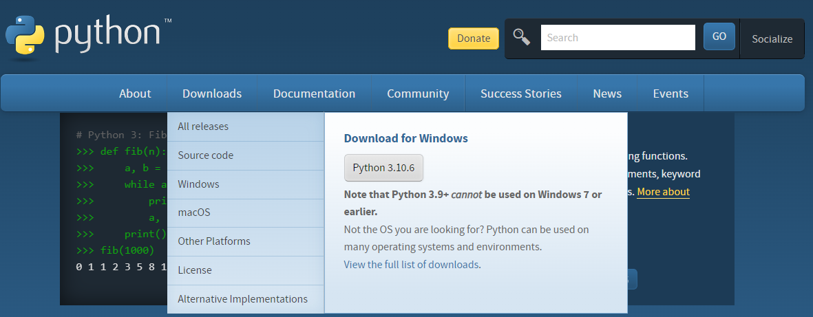
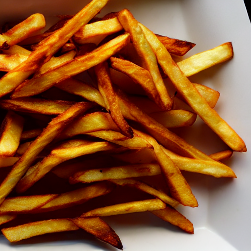

## はじめに

物理部中２のPC班員です。中３から部誌を書こうと思っていましたが、ちょうどいいネタが転がり込んできたので書くことにしました。

## 使うライブラリのインストール

今回使うStable Diffusionは最近オープンソース化され、商用利用も可能という素晴らしいライブラリです。
PCの推奨スペックはVRAM10G以上のnvidiaのGPUで、今回はRTX3060というGPUを使っていきます。

### 1.リポジトリにアクセスするためのトークンを作る

まず[ここ](https://huggingface.co)にアクセスして右上の`Sign Up`からアカウントを作成し、次に[ここ](https://huggingface.co/CompVis/stable-diffusion-v1-4)にアクセスして`Access repository`をクリックした後、サイト右上のアカウントアイコンをクリックして`Settings`から左の`Access Tokens`からトークンを作成する。このトークンが後で必要になるのでメモしておく。


### 2.必要なソフトとライブラリ

#### Python

まずは今回のコードを書くためにプログラミング言語のPythonをインストールする。
[Python公式サイト](<http://python.org>)からpythonのインストーラーをダウンロードしてインストールする。インストール時にPythonをパスに追加するオプションを選択するのを忘れずに。

{width=400}

#### ドライバ

{width=400}

今回はAIの演算にCUDAというnvidia製のグラフィックボードについているものを使うので、[ここ](https://www.nvidia.co.jp/Download/index.aspx?lang=jp)からドライバを手に入れてインストールする。

#### CUDA Toolkit

[ここ](https://developer.nvidia.com/cuda-downloads)からダウンロードしてインストールする。
そしてコマンドプロンプトで`nvcc -V`を実行して正常にインストールされているかを確認する。
このとき`release`の後にある数字をメモしておく。

#### cuDNN

[ここ](https://developer.nvidia.com/rdp/cudnn-download)からダウンロードして解凍した`bin`フォルダにパスを通す。
この時、ダウンロードにnvidiaデベロッパーアカウントが必要なので作成する。

#### PyTorch

[ここ](https://pytorch.org/get-started/locally/)からPyTorchをインストールするためのコマンドを生成する。
* PyTorch Build: Stable
* Your OS:使用しているコンピュータのOSを選択
* Package:Pip
* Language:Python 
* Compute Platform:先ほどメモしたReleaseの数字に合うものを選択
その後、生成されたコマンド(`Run this Command`にある文字列)を実行してPyTorchをインストールする。
インストール後、以下のコマンドでPyTorchからGPUが使用可能かを試す。Trueになれば使用可能。

```
PS C:\Users\hoge> python
Python 3.10.6 (tags/v3.10.6:9c7b4bd, Aug  1 2022, 21:53:49) [MSC v.1932 64 bit (AMD64)] on win32
Type "help", "copyright", "credits" or "license" for more information.
>>> import torch #時間がかかるので注意
>>> torch.cuda.is_available()
True
>>>
```

#### その他

ライブラリを使用するためのライブラリをインストールする。コマンドプロンプトで
```pip install diffusers==0.2.4 transformers scipy ftfy```
を実行する。

## 生成

```python
import torch
from torch import autocast
from diffusers import StableDiffusionPipeline
pipe = StableDiffusionPipeline.from_pretrained
("CompVis/stable-diffusion-v1-4",
revision="fp16", torch_dtype=torch.float16, 
use_auth_token="ここにさっき作成したトークンを入力")
pipe = pipe.to("cuda")
prompt = input("prompt:")
pipe.safety_checker = lambda images, **kwargs: (images, False)
with autocast("cuda"):
    image = pipe(prompt)["sample"][0]
image.save(f"{prompt}.png")
```

以上のコマンドをpythonで実行することで実行したディレクトリに画像が生成される。

## 生成したお気に入りの画像たち





## 参考文献

<https://huggingface.co>

<https://zenn.dev/ryu2021/articles/3d5737408b06fe>

<https://twitter.com/kawai_nae/status/1561843126842851328>
