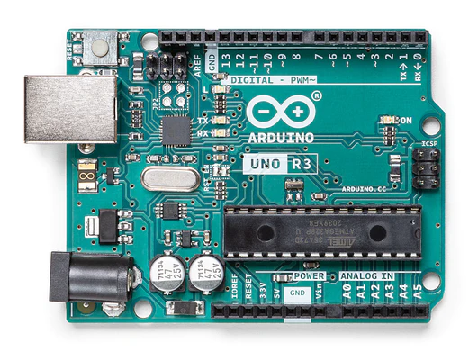
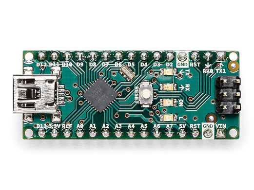
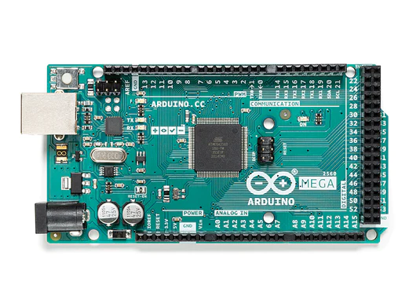
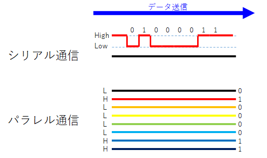
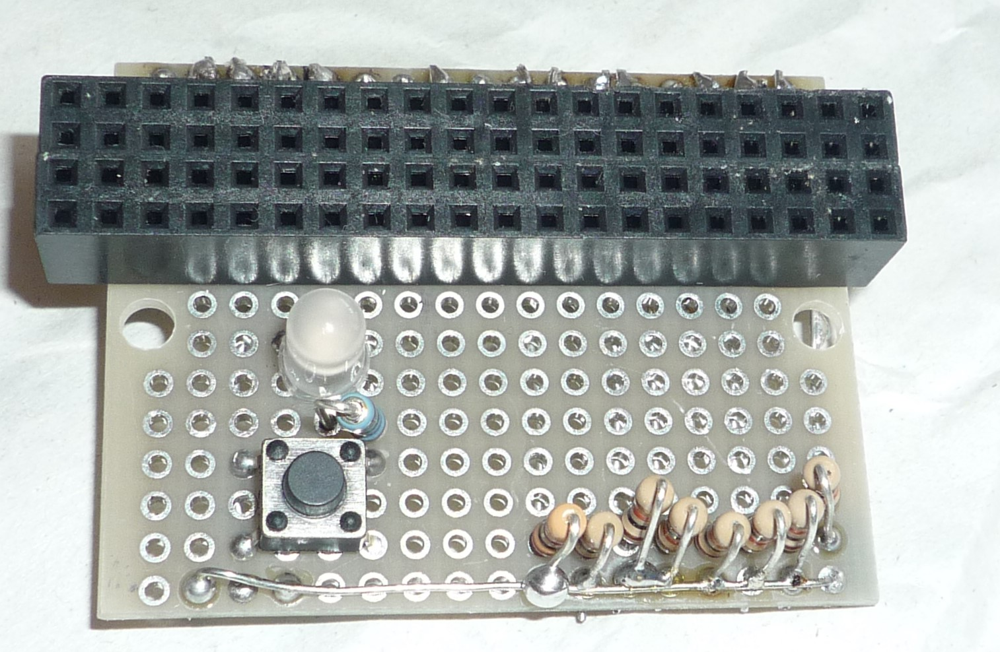

## はじめに

  物理部の中3の電工班です。今回が初めての部誌となっています。今回は、文化祭で展示する作品の説明的なものを書かせていただきます。

## 始めたきっかけ

  部活の先輩から譲り受け、引き継ぎました。その時はラズパイ内蔵でライトが光り、モーターが回っていましたが、レールの上は走っていませんでした。
  先代ではラズベリーパイを使用していましたが大きすぎて、配線の都合で何故か起動もしなくなったのでArduinoというマイコンを使用しました。
  しかし、ArduinoにはWi-Fi機能がないため基本外部との通信ができませんでした。そのため、下に書いた通り、赤外線信号を使用することにしました。

## 全体像

  この改造では、PC、ArduinoMega、ArduinoUnoとその他諸々の部品を使いました。使用部品のすべては下に書いてあります。この3台の通信の関係は以下のようになります。

  

  赤外線通信や、シリアル通信については後ほど説明します。

## 今回の改造での使用部品

  今回使用した部品です

* プラレール
  * Arduino Nano  1台 
  * トランジスタ 2SC2120-Y 1台
  * LED4本と抵抗器4つ(前と後ろのLED)
  * 9V型電池1つ 
  * 配線用の線と基盤 必要数
* 信号装置側
  * Arduino mega1台とそこに取り付ける自作シールド
  * 信号装置ユニット(LED3つと照度センサー) 4組
  * 専用線路(信号装置ユニットを取り付け、CdSセル各1つ) 4台
  * 液晶モジュール [1602A](https://amzn.asia/d/bCDdQ7B) 1台
  * ブレッドボード
  * ジャンパピン 必要なだけ
  * その他配線用導線 必要なだけ

## そもそもArduinoとは

  Arduinoとは、マイコンの一種であり、デジタル入出力、アナログ入力、アナログ出力(PWM(パルス幅変調)を使ったデジタル出力)、USBを使ったシリアル通信などに対応しています。下の画像はArduinoの中でも一番有名なArduino Unoです。(Arduinoの画像3つは[Arduino公式ストア](https://store.arduino.cc)からです。)

  {height=300}
  
  しかし、これではプラレール本体に積み込むのには大きすぎます。そのため、今回プラレールの中に入れたのは下のArduinoNanoです。  
    
   
  こちらはUnoよりも小さいのですが、機能はほとんど変わらないので、便利です。しかし、部活には、Nanoの正規品がなかったので、ほぼ仕様が変わらない互換品を使用しました。
  また、信号装置側では、信号ユニット4台、液晶モジュール1台、赤外線送信線1本、その他諸々をつなぎたいのですが、UnoやNanoにはデジタルピンを13本(正確には、アナログピンもデジタルピン扱いできるので、実質、18本ですが、ここでは面倒ですので割愛します。)しかないので、足りなくなりました。そのため、ピン数が、53本(デジタルピンのみでは)ある、ArduinoMegaを使いました。
  
  

## 赤外線通信とは

  今回は、信号装置からプラレールへの送信のために使用しました。赤外線通信とは目には見えない赤外線を高速で点滅させることにより、データを送信することです。それをArduinoでやろうとすると、高速に赤外線LEDを点滅させる必要があるうえ、他のプログラムとの同時実行を行う必要があり難易度が高いため、専用ライブラリを使用しました。それが、[IRremote](https://www.arduino.cc/reference/en/libraries/irremote/)という赤外線通信用のライブラリです。これを使用することで赤外線信号を簡単に入出力できます。IRremoteは[参考にしたサイト](https://burariweb.info/electronic-work/arduino-learning/arduino-ir-module-use.html)に合わせてバージョン2.8.1を使用しています。このライブラリでは、赤外線の受信、送信が可能で赤外線信号を16進数32ビットで管理していて容易に通信を行えます。

  
## シリアル通信について

  この改造ではPCとArduinoMegaとの接続に使用しました。厳密にいうと、シリアル通信をUSBに変換していますが、シリアル通信と同様に使用できます。ArduinoMegaでは、パソコンから送られてきた速度情報を赤外線信号にして、ArduinoUnoに渡す役割と、パソコンに自作した線路上のセンサーを使って取得した車両の位置を送信しています。シリアル通信については詳しくは[こちら](https://qiita.com/hsgucci/items/eee5894e3651d0a8cb75)  
  を参考にしてほしいのですが、簡単に言うと、一本の信号線で電圧の強弱をもとにデータを送る方法です。

  

  <https://qiita.com/hsgucci/items/eee5894e3651d0a8cb75>から引用。パラレル通信については後ほど解説

  ここでシリアル通信でArduinoMegaと接続しているPC側の説明をします。こちらは、Arduinoで使用しているC++(厳密にはArduinoではC++の拡張言語を使用)とは全然違うHTML+CSS+JavaScriptで操作しています。理由は、単純にJavaScriptのほうが環境構築が楽だったからです。webブラウザでも、chrome89から使用可能になったWebSerial APIを使うことでシリアル通信ができるので(詳しくは長くなるので説明しませんが、[こちら](https://web.dev/i18n/ja/serial/)を参考してください)これを使用してシリアル通信を行っています。

## 液晶モジュールについて

  今回使用した液晶モジュールは1602Aという型番のものです。
  これをArduinoで制御するにはパラレル通信か、シリアル通信での接続が必要ですが、シリアル通信に必要な[専用の変換基板](https://amzn.asia/d/1mzUWsf)がなかったのでパラレル通信にしました。シリアル通信は前述したとおりですが、パラレル通信は、複数の線で制御するしくみです。
  

  パラレル通信によって液晶モジュールにたくさんArduinoのピンが取られてしまいましたが、ArduinoMegaにしたので問題はありませんでした。
  液晶モジュールをArduinoで制御するには信号線4本(か8本)を制御する必要がありますが、難しいので、[ここで](https://www.arduinolibraries.info/libraries/liquid-crystal)配布されている専用のライブラリを使用しました。
  このライブラリは最初に設定(ライブラリを読み込み後、`LiquidCrystal(rs, rw,  enable, d0, d1, d2, d3, d4, d5, d6, d7);`)をすれば、あとは対応する文字をそのまま関数の引数に書く(必要ならカーソル移動後に ` lcd.print(表示したい文字); `)だけで制御できるので簡単です。

## 自作線路の下にあるもの

  ArduinoMegaの車両位置を確認するため、4箇所に自作線路をつけました。

  
  

  これには、信号機と、車両の通過を検出するセンサーが入っています。今回は、線路の下にセンサーを入れて、車両が通ると光が遮られ、暗くなるのを利用するために光センサー(CdSセル)を使用しました。光センサーは、明るさによって抵抗値が変わることを利用して、可変抵抗と同じ方法で値を取得しています。また、ArduinoMegaのアナログピンの近くにある電源関連のピンの本数不足が起こってしまったので簡易的なモジュールを作成しました。そこには、ピン数の拡張だけではなく、電源確認ランプ、リセットボタン、アナログ入力の際に必要になる抵抗装置を入れました。

  

## 内部配線について

  車両の前と後ろにLED各2本ずつと、モーター、Arduino、赤外線受信機、その他電源関連の基盤などを入れました。それぞれは下の図のように接続しました。

  

  (こちらは夏休み時点の画像ですので文化祭では変更になっている可能性があります)
  回路図は下のようになりました

  

## モータードライバーについて

  ~~今までの物理部の部誌で何度か出てきたTA7291Pを使用しました。~~ モータードライバーを使おうと思って制作していたのですが、夏休みに原因不明の問題(多分、熱で壊したと思われる)が発生したため、トランジスタを使用しました。トランジスタの仕組みは<https://deviceplus.jp/arduino/entry011/>を参考にしました。

## 終わりに

  ここまで今年で行った改造のほぼすべてを書きました。プラレール本体の改造はここに書いたとおりにやればできるはず(結構試行錯誤しないといけないところが出てくると思いますが)なので~~ラズパイを壊す必要はありません~~やってみたかったらやってください。(ただし、ここにある改造を行ったことで被ったすべての損害に対して責任を負いません)とても長くなりましたがここまで読んでいただいてありがとうございます。

## 参考文献と本文中のリンク一覧

* Arduino公式ストア  
  <https://store.arduino.cc>
* ライブラリ IRromote  
  <https://www.arduino.cc/reference/en/libraries/irremote/>
* 赤外線通信プログラム時に参考にしたサイト  
  <https://burariweb.info/electronic-work/arduino-learning/arduino-ir-module-use.html>
* シリアル通信とは  
  <https://qiita.com/hsgucci/items/eee5894e3651d0a8cb75>
* web serial API  
  <https://web.dev/i18n/ja/serial/>
* 液晶モジュールのライブラリ  
  <https://www.arduinolibraries.info/libraries/liquid-crystal>
* トランジスタの仕組み  
  <https://deviceplus.jp/arduino/entry011/>
