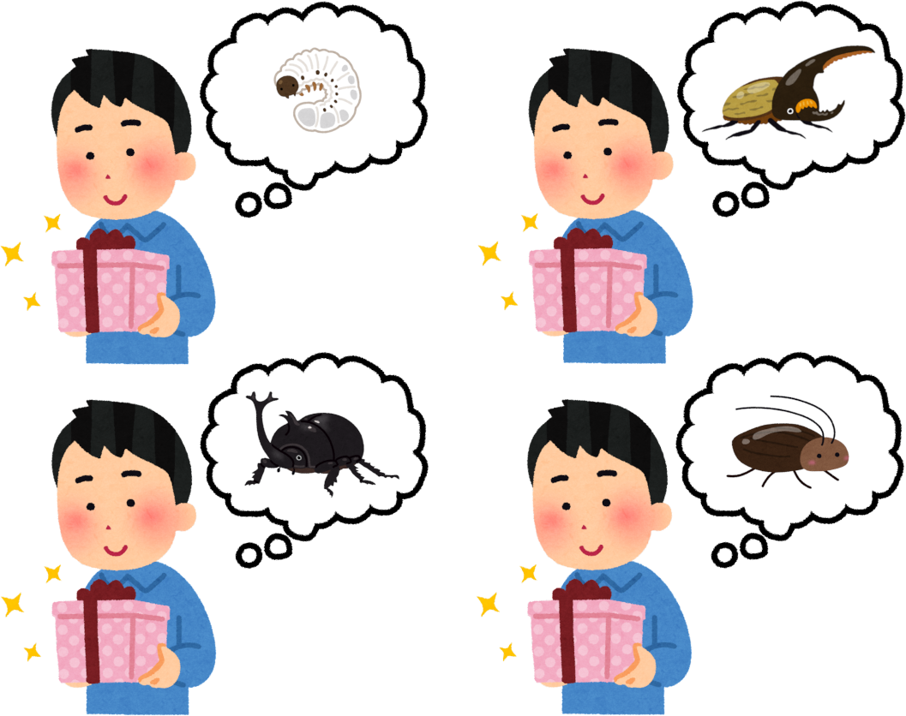

## 「シュレディンガーの猫」を考える

「シュレディンガーの猫」は有名だろう。（細かい説明は割愛するが）かの有名な物理学者シュレディンガーが

> 猫と任意の放射性物質を箱に密閉する。
> 放射性物質が崩壊する確率を一時間あたり50%とする。
> 崩壊した原子が出す放射線を検知すると毒ガスが放出される。

といった条件下で、観測者が箱の中身を確認するまで「猫が生きている確率」と「猫が死んでいる確率」がそれぞれ50%ずつである、
つまり猫は「生きているし死んでいる」という、今までのマクロな世界における解釈と矛盾した奇妙な状態におかれることになるとした。
彼はこの思考実験をもってミクロの世界における確率の解釈に対して問題提起をしたのだ。

なぜ「シュレディンガーの猫」がここまで有名になったのだろうか。物理（量子力学）と関係ない文脈においても、「奇妙な思考実験」や「結果として導かれるパラドックス」
の代名詞のようにこの名前はしばしば登場する。  
これはおそらく「＜人名＞の＜一般名詞＞」という言葉の組み合わせの覚えやすさ、そして「シュレディンガー」「猫」という言葉を組み合わせた時の
語呂の良さに起因するのではないか。今回はもう一つ、この人名/一般名詞の思考実験を紹介しよう。「ヴィトゲンシュタインのカブト虫」だ。

## ヴィトゲンシュタイン？

ゆっくり解説レベルの雑な導入ではあるが、まずは今回触れる「ヴィトゲンシュタインのカブト虫」の前提知識から紹介していこう。
ルートヴィヒ・ヴィトゲンシュタインはオーストリア出身の哲学者だ。第一次世界大戦の直後に出版した『論理哲学論考』、
そして遺稿をもとに出版された『哲学探求』で有名で、特に『論考』は文庫本にもなっているほか、

> 語りえぬことについて、人は沈黙せねばならない。

という一節においてよく知られている。
（そして非常に難解なことも）

では『探求』はどうか？  
『探求』は一言で言うなら自己批判だ。『論考』で示された

> 言語に含まれる言葉一つ一つはそれそのものを表す像（実体）と対応していて、全ての言葉には決まった意味がある。目の前のものを指さして、それに対応する名前を呼ぶのに近い。

といった、ヴィトゲンシュタイン以前の哲学者と同じ潮流にある古典的な言語観に代わる新たな言語観の提示など、後期ヴィトゲンシュタインの思考を辿る上で欠かせない著作だが、
こちらは『論考』の影に隠れあまり語られることはない。

例えばある人の思い出を記録したアルバムのように、通し番号が付され独立した節（アルバムにおける写真）を最小単位として、
あるものは独立して、またあるものは他の節と共に一つの記述に対する一連の考察を構成する「アルバム形式」や
ダッシュ（――）を挟み一方では現在（執筆時）のヴィトゲンシュタインが、
もう一方では『論考』以前の言語観をもつある哲学者（過去の彼を念頭に）が語る「疑似対話」などの独特な論述や分量の多さ、
そしてそもそも文庫本になっていないなど読破する上でハードルが高いのが原因だろうか。

今回は、『哲学探究』でヴィトゲンシュタインが示した考え方に少しでも触れてもらうため、彼が無意識下に想定しているであろう前提なども明らかにしながら、
『探求』で行われた「カブト虫」に関する思考実験をなるべくわかりやすい形で「追試」してみよう。

## 追試

「カブト虫」の思考実験は§243から行われる私的言語、とりわけ「痛み」に代表される感覚語についての哲学的考察の一環だ。まずは「カブト虫」の思考実験の前提知識を以下に示す。

> ヴィトゲンシュタインは先に触れた『論考』的言語解釈を疑問視している。（「対称と名」モデル）
> 代わりに、言葉の意味は実際に「言語ゲーム（独：Sprachspiel）」でどう扱われているかで解釈すべきと考えている。
> ニュアンスは「ことば遊び」が近い。言葉を用いたやり取りなどを「ゲーム」にたとえ、言葉の意味をゲームにおける機能に注目してとらえる。

この「論考」的な「対象と名」モデルを前提にして以下の思考実験を行うとわかりやすいはずだ。

> あるグループの人たちがそれぞれ箱を持っていて、その中に「カブト虫」と呼ばれる何かが入っている。
> 他の人が持つ箱の中身は見えない。
> 「カブト虫」が何を表すかは自分の「カブト虫」を見ることによってわかる。

という条件で、「カブト虫」という言葉と「カブト虫そのもの」の関係について考えてみよう。  
お互いの箱の中身が見えるなら、「カブト虫」が何を指すかは明確だ。  
しかしここでは他人の箱の中身が見えない。もしそうであれば、箱の中身が何であっても「カブト虫」という名が指す「何か」は
実は何であってもよいのではないか。自分にとって、他人の箱の中にある「カブト虫」はおおよそカブト虫とは呼べないような代物であっても、
はたまた常に変化し続けるような何かであっても、
本人がそれを「カブト虫」と呼んでいるなら「カブト虫」という言葉を用いる言語ゲームにおいて
何か齟齬が生じるわけでもないし、そもそもそれを判別する手立てもない。
ヴィトゲンシュタインはそう考えたのだ。

> それでもこの人々の『カブト虫』という言葉が使用されているとしたら？（§293）

その場合、箱の中にある「カブト虫と呼ばれるもの」
（注：カブト虫という名前のことではない。本人は「カブト虫」と呼ぶが他の人が見たら「クワガタ」と呼ぶようなものでもあってよい、ということ。）
自体はこの言語ゲームにおいて「あるもの」としてすら意味を成さず、そもそも言語ゲームに属していないといえるのだ。
そもそも、これは箱の中に何も入っていなくとも成立するのだから。

ヴィトゲンシュタインはこの思考実験を通して
「痛み」に限らず感覚を表す文法を「対象と名」――ここでは痛みと痛みそのもの（痛みの像？）――というモデルに即して解釈しても、
上記の理由でこのとき想定した「痛みそのもの」は意味を成さず、これを想像することはナンセンスであることを示している。
（そして我々がそう解釈したくなる誘惑に駆られることも）  
つまり痛みの対象、痛みそのものが「存在する」か「存在しない」かではなく、それを想定すること自体がナンセンスということだ。

> ここで私は、それを回しても他の歯車が一緒に動かないような歯車は、機械の一部ではない、と言いたいのだ。（§271）

ここで先述の言語ゲーム的解釈を適用してみよう。つまり「痛みそのもの」は想定せず、
もっぱら「痛み」という語が人々の間でどう使用されるかに注目することで、
我々は「対象と名」モデルには縛られず――カブト虫が本当は何であるか考えることなく――パラドックスを解消できる。

## さいごに

『哲学探究』ではこのカブト虫の例の他にも「理解」「読むこと」「規則」など我々が言語を解釈するときに駆られるさまざまな「誘惑」に対して、
複数の思考実験やたとえ話を用いた精緻な考察から、それらに惑わされないための考え方を彼の実際の思考過程に即して示している。  
『論考』的解釈はアウグスティヌスを始め、我々現代人も様々な媒体から無意識のうちに受容してしまっているかもしれない。
彼独特の思考過程を辿りこの解釈を打破して「考えたところでナンセンスでしかないもの」から解放される経験は、多くの読者にとって
ある種爽快な意外性をもって受け入れられるだろう。
これをきっかけに多くの人が彼の著作に触れることを願っている。

## 参考文献

- L.ヴィトゲンシュタイン著 鬼界彰夫訳『哲学探究』（講談社）、§243~§315
